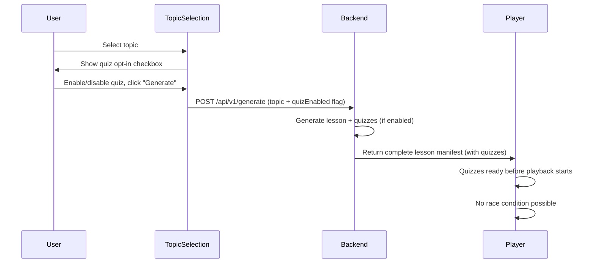
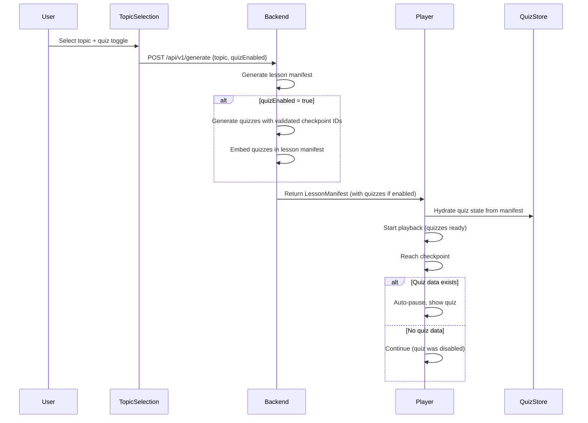
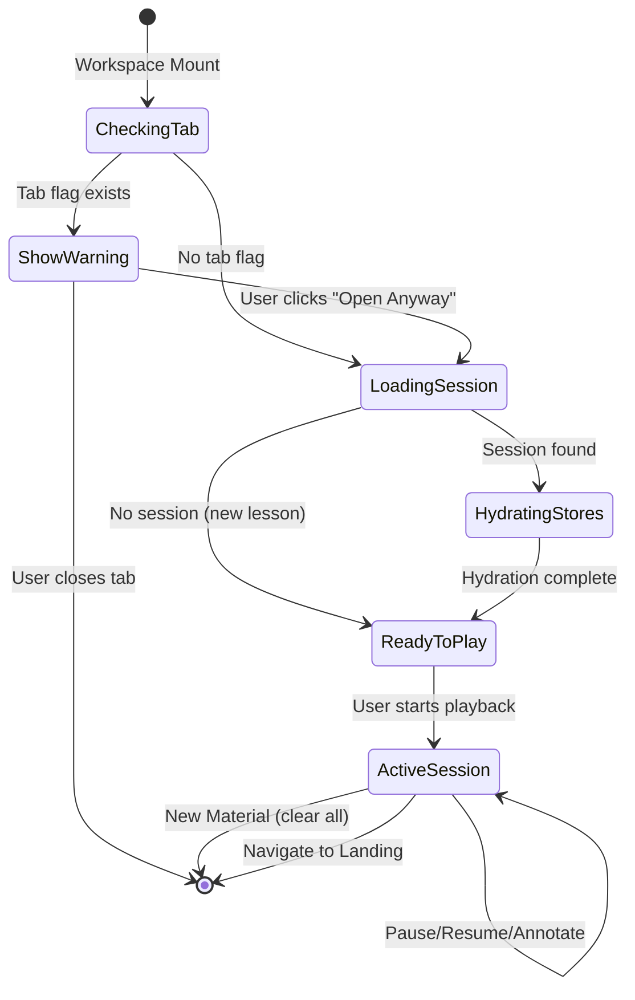

# Architecture Validation Report

## Validation Overview

This report documents the architecture validation of spec:509268fd-53cc-4271-8fce-6b32f347b891/d4d5c704-49c4-4a74-96ec-a28ef59cc113 (Tech Plan), focusing on quiz API integration and session persistence patterns. All critical gaps have been identified and resolved through clarification.

**Validation Status:** ✅ **APPROVED - Ready for Implementation**

**Date:** 2026-01-30

---

## Critical Gaps Resolved

### 1. Quiz System Architecture - MAJOR SIMPLIFICATION

**Original Design (Tech Plan):**
- Separate API endpoint (`/api/v1/lessons/{id}/quizzes`)
- Lazy loading after lesson loads
- Race condition risk: user might reach checkpoint before quizzes load

**Validated Design (Updated):**
- **Quiz opt-in at topic selection stage**
- Quizzes generated during lesson generation (not lazy loaded)
- No separate quiz API endpoint needed
- Quizzes embedded in lesson manifest JSON

**Updated Flow:**



**Benefits:**
- ✅ Eliminates race condition entirely
- ✅ Simpler API (one endpoint instead of two)
- ✅ Better UX (user decides upfront, not mid-lesson)
- ✅ Faster playback start (no waiting for quiz API)

**Implementation Changes:**
- Add quiz toggle to topic selection UI
- Backend generates quizzes during lesson generation if `quizEnabled=true`
- Quizzes embedded in `LessonManifest.quizzes` field (not separate endpoint)
- Remove `/api/v1/lessons/{id}/quizzes` endpoint from Tech Plan

---

### 2. Multiple Tab Synchronization

**Issue:** localStorage doesn't sync across tabs in real-time. Could cause data loss or confusion.

**Validated Solution:** **Single-Tab Enforcement**

**Implementation Approach:**

1. **Tab Detection:**
   - Use `localStorage` flag: `studyfied_active_tab_{lessonId}`
   - On workspace mount: Check if flag exists
   - If exists: Show warning overlay "Lesson already open in another tab"
   - If not exists: Set flag with unique tab ID

2. **Tab Cleanup:**
   - On workspace unmount: Clear tab flag
   - On `beforeunload` event: Clear tab flag
   - Use `visibilitychange` to detect tab close

3. **Warning UI:**
   - Full-screen overlay with message and "Open Anyway" button
   - "Open Anyway" forcefully takes over (clears other tab's flag)

**Trade-offs:**
- ✅ **Pro**: Prevents data loss from conflicting writes
- ✅ **Pro**: Simple implementation (just flag checking)
- ❌ **Con**: User can't compare two lessons side-by-side
- ❌ **Con**: Flag might persist if browser crashes (mitigated by timestamp check)

**Accepted Risk:** If browser crashes, flag persists. Mitigation: Add timestamp to flag, ignore if >5 minutes old.

---

### 3. Session Data Size Management

**Issue:** Annotations could grow unbounded, potentially exceeding localStorage 5-10MB limit.

**Validated Solution:** **Accept the Risk for MVP**

**Rationale:**
- Hackathon timeline prioritizes core functionality over edge case handling
- Typical usage unlikely to hit limits (few lessons, moderate annotation)
- Post-MVP can add monitoring and cleanup

**Monitoring Strategy (Post-MVP):**
- Track localStorage usage: `navigator.storage.estimate()`
- Show warning at 80% capacity
- Implement LRU eviction or compression

**Accepted Risks:**
- ❌ Heavy annotation users might hit localStorage limits
- ❌ No automatic cleanup of old sessions
- ❌ No user feedback if storage fails

**Mitigation for Demo:**
- Test with realistic annotation usage
- Document limitation in README
- Add try-catch around localStorage writes (fallback to in-memory)

---

### 4. Quiz-Checkpoint ID Validation

**Issue:** Quiz `checkpointId` might not match lesson `checkpoint.id` if generated by different AI agents.

**Validated Solution:** **Strict Validation with Retry**

**Implementation Approach:**

1. **Backend Validation:**
   - After AI Director generates lesson manifest (with checkpoints)
   - After Quiz Generator generates quizzes (with checkpointIds)
   - Validate: Every quiz `checkpointId` exists in lesson `checkpoints` array
   - If mismatch: Log error, retry quiz generation (max 1 retry)
   - If still fails: Return lesson without quizzes, log warning

2. **Validation Logic:**
   ```python
   def validate_quiz_checkpoints(lesson: LessonManifest, quizzes: QuizCheckpoint) -> bool:
       lesson_checkpoint_ids = {cp.id for cp in lesson.checkpoints}
       quiz_checkpoint_ids = {q.checkpoint_id for q in quizzes.questions}
       return quiz_checkpoint_ids.issubset(lesson_checkpoint_ids)
   ```

3. **Error Handling:**
   - If validation fails after retry: Return lesson with `quizzes: []`
   - Frontend: If no quizzes, disable quiz toggle automatically
   - User sees lesson without quiz option (graceful degradation)

**Trade-offs:**
- ✅ **Pro**: Prevents quiz system from breaking silently
- ✅ **Pro**: Retry gives AI second chance to fix IDs
- ❌ **Con**: Adds validation overhead (~10ms)
- ❌ **Con**: Retry adds latency if first attempt fails

---

### 5. Session Hydration Timing

**Issue:** Loading session in `useEffect` could cause brief flash of default state before session restores.

**Validated Solution:** **Show Loading State**

**Implementation Approach:**

1. **Loading State Management:**
   - Add `isHydrating` flag to `sessionStore`
   - On workspace mount: Set `isHydrating = true`
   - Load session from localStorage
   - Hydrate all stores (player, quiz, session)
   - Set `isHydrating = false`

2. **UI Rendering:**
   - If `isHydrating`: Show loading spinner overlay
   - If `!isHydrating`: Render player with hydrated state
   - Duration: ~50-100ms (localStorage read is fast)

3. **Loading UI:**
   - Centered spinner with message: "Loading lesson..."
   - Prevents user from seeing state flash
   - Smooth transition to player

**Trade-offs:**
- ✅ **Pro**: Clean UX, no state flashing
- ✅ **Pro**: Simple implementation (boolean flag)
- ❌ **Con**: Adds ~100ms perceived load time
- ❌ **Con**: Extra loading state to manage

**Accepted Trade-off:** 100ms loading state is acceptable for clean UX.

---

### 6. Quiz Caching Strategy

**Issue:** Should quizzes be cached after first fetch or always fetched fresh?

**Validated Solution:** **No Caching - Always Fetch Fresh**

**Rationale:**
- Simpler implementation (no cache invalidation logic)
- Ensures consistency (quizzes always match lesson)
- With new design (quizzes in lesson manifest), caching is automatic via lesson caching

**Implementation:**
- Quizzes are part of `LessonManifest` (embedded)
- Lesson manifest cached in IndexedDB
- No separate quiz caching needed
- On "Replay": Reuse cached lesson manifest (includes quizzes)

**Trade-offs:**
- ✅ **Pro**: Simplest possible approach
- ✅ **Pro**: No stale data issues
- ✅ **Pro**: Automatic caching via lesson caching
- ❌ **Con**: None (quizzes are part of lesson, cached together)

---

### 7. Session Cleanup Strategy

**Issue:** Old sessions accumulate in localStorage over time.

**Validated Solution:** **No Automatic Cleanup for MVP**

**Rationale:**
- Hackathon scope prioritizes core features
- Manual cleanup via "New Material" is sufficient for demo
- Post-MVP can add automatic cleanup

**Accepted Risks:**
- ❌ localStorage fills with old sessions over time
- ❌ No user-facing cleanup UI

**Post-MVP Enhancements:**
- Time-based cleanup (delete sessions >7 days old)
- LRU eviction (keep only 10 most recent)
- Settings UI with "Clear All Sessions" button

**Mitigation for Demo:**
- Test with fresh browser profile
- Document cleanup limitation in README

---

## Updated Architecture

### Quiz System (Revised)

**Key Change:** Quiz opt-in moved to topic selection stage.

**Updated Data Flow:**



**Updated Data Model:**

```typescript
// Lesson manifest now includes quizzes
interface LessonManifest {
  lessonId: string;
  topicTitle: string;
  duration: number;
  scenes: Scene[];
  checkpoints: Checkpoint[];
  assets: Asset[];
  transcript: TranscriptLine[];
  quizzes: QuizQuestion[];  // NEW: Embedded quizzes (empty if disabled)
}
```

**API Changes:**

| Endpoint | Method | Request | Response |
|----------|--------|---------|----------|
| `/api/v1/generate` | POST | `{topic, quizEnabled}` | `LessonManifest` (with quizzes) |

**Removed Endpoints:**
- ~~`/api/v1/lessons/{id}/quizzes`~~ (no longer needed)

---

### Session Management (Validated)

**Confirmed Approach:**
- localStorage with per-lesson isolation
- Single-tab enforcement via flag checking
- Loading state during hydration
- No automatic cleanup (manual via "New Material")

**Updated Session Lifecycle:**



**Implementation Details:**

1. **Tab Flag Structure:**
   ```typescript
   // Key: studyfied_active_tab_{lessonId}
   interface TabFlag {
     tabId: string;  // Unique ID for this tab
     timestamp: number;  // When flag was set
   }
   ```

2. **Hydration Loading State:**
   - Show spinner overlay: "Loading lesson..."
   - Duration: ~50-100ms
   - Prevents state flash

3. **Accepted Risks:**
   - localStorage size limits (no monitoring)
   - No automatic session cleanup
   - Tab flag might persist on crash (mitigated by timestamp check)

---

### AI Pipeline Constraints (Validated)

**Confirmed Approach:**
- Soft constraint enforcement via prompt engineering
- Asset Factory slices to first 5 images (fail-safe)
- No hard validation (trust AI)

**Updated Constraint Enforcement:**

| Component | Constraint | Enforcement |
|-----------|-----------|-------------|
| **Image Steering** | Max 5 prompts | Prompt: "Generate exactly 5 image prompts" |
| **Asset Factory** | Max 5 images | Code: `prompts[:5]` (slice) |
| **AI Director** | Max 3 min duration | Prompt: "Lesson duration ≤180 seconds" |
| **Quiz Generator** | Checkpoint ID match | Validation: Strict check + retry |

**No Changes Needed:** Approach validated as-is.

---

## Updated Component Architecture

### Frontend Components (Revised)

**Topic Selection Screen (Updated):**
- Add quiz opt-in checkbox/toggle
- Label: "Include interactive quizzes" (checked by default)
- Pass `quizEnabled` flag to generation API

**Workspace Components:**

| Component | Responsibility | Changes |
|-----------|---------------|---------|
| `Workspace.tsx` | Session lifecycle, tab detection | Add tab flag check, loading state |
| `QuizOverlay.tsx` | Quiz UI with "Continue" button | No changes |
| `QuizToggle.tsx` | ~~Toolbar toggle~~ | **REMOVED** (opt-in at topic selection) |
| `CompletionOverlay.tsx` | Show quiz score | No changes |

**Stores (Revised):**

| Store | Responsibility | Persistence |
|-------|---------------|-------------|
| `playerStore` | Playback state | localStorage (via middleware) |
| `quizStore` | Quiz state (questions, answers, score) | localStorage (via middleware) |
| `sessionStore` | Session metadata, tab flag | localStorage (direct) |
| `lessonStore` | Lesson manifest (with quizzes) | IndexedDB |

**Note:** Quiz toggle removed from player toolbar (opt-in happens at topic selection).

---

### Backend Services (Revised)

**Generation Pipeline (Updated):**

```python
# backend/app/routers/lessons.py
@router.post("/api/v1/generate")
async def generate_lesson(request: GenerateRequest):
    # Extract topic from content
    topic = await librarian.extract_topic(request.content)
    
    # Generate images (max 5)
    image_prompts = await image_steering.generate_prompts(topic)
    assets = await asset_factory.generate_assets(image_prompts[:5])
    
    # Generate lesson
    lesson = await ai_director.generate_lesson(topic, assets)
    
    # Generate quizzes if enabled
    if request.quiz_enabled:
        quizzes = await quiz_generator.generate_quizzes(topic, lesson)
        
        # Strict validation
        if not validate_checkpoint_ids(lesson, quizzes):
            # Retry once
            quizzes = await quiz_generator.generate_quizzes(topic, lesson)
            if not validate_checkpoint_ids(lesson, quizzes):
                # Fail gracefully
                quizzes = []
        
        lesson.quizzes = quizzes
    else:
        lesson.quizzes = []
    
    return lesson
```

**Validation Function:**

```python
def validate_checkpoint_ids(lesson: LessonManifest, quizzes: List[QuizQuestion]) -> bool:
    lesson_checkpoint_ids = {cp.id for cp in lesson.checkpoints}
    quiz_checkpoint_ids = {q.checkpoint_id for q in quizzes}
    
    # All quiz checkpoints must exist in lesson
    return quiz_checkpoint_ids.issubset(lesson_checkpoint_ids)
```

---

## Robustness Analysis

### Failure Mode Testing

| Failure Scenario | System Response | User Impact |
|------------------|-----------------|-------------|
| **Quiz generation fails** | Return lesson with `quizzes: []` | Lesson plays without quizzes (graceful) |
| **Quiz-checkpoint ID mismatch** | Retry once, then return empty quizzes | Lesson plays without quizzes (graceful) |
| **localStorage full** | Fallback to in-memory, show warning | Annotations lost on refresh (acceptable for MVP) |
| **Multiple tabs detected** | Show warning overlay | User chooses to close other tab or force open |
| **Session hydration fails** | Start with default state (0:00, no annotations) | User loses progress (rare, acceptable for MVP) |
| **Tab flag persists (crash)** | Timestamp check: ignore if >5 min old | User can open lesson after 5 min (acceptable) |

### Simplicity Validation ✅

**Complexity Reduced:**
- ❌ Removed: Separate quiz API endpoint
- ❌ Removed: Quiz lazy loading logic
- ❌ Removed: Quiz toggle in player toolbar
- ✅ Added: Simple checkbox at topic selection
- ✅ Added: Quizzes embedded in lesson manifest

**Result:** Simpler architecture with fewer moving parts.

---

### Flexibility Validation ✅

**Requirement Changes:**

| Change | Impact | Effort |
|--------|--------|--------|
| Add new quiz types (diagram-marking) | Add to `QuizQuestion.type` enum | Low |
| Add quiz difficulty levels | Add to quiz generation prompt | Low |
| Enable quiz toggle during playback | Re-add `QuizToggle` component | Medium |
| Add quiz analytics dashboard | Use existing `/api/v1/analytics/quiz-results` | Low |

**Result:** Architecture is flexible for likely future changes.

---

### Codebase Fit Validation ✅

**Alignment with Existing Patterns:**

| Pattern | Tech Plan Approach | Existing Codebase | Fit |
|---------|-------------------|-------------------|-----|
| **API Design** | REST with Pydantic | ✅ Matches file:docs/architecture.md | ✅ |
| **State Management** | Multiple Zustand stores | ✅ Matches existing pattern | ✅ |
| **Naming** | camelCase JSON, snake_case Python | ✅ Matches existing convention | ✅ |
| **Error Handling** | Graceful degradation | ✅ Matches existing approach | ✅ |
| **Storage** | localStorage + IndexedDB | ✅ Matches existing pattern | ✅ |

**Result:** No conflicts with existing codebase patterns.

---

## Implementation Readiness Checklist

### Quiz System ✅
- [x] Quiz opt-in UI at topic selection
- [x] Quiz generation integrated into lesson pipeline
- [x] Quizzes embedded in lesson manifest
- [x] Checkpoint ID validation with retry
- [x] Quiz score calculation in frontend
- [x] Completion overlay displays score

### Session Management ✅
- [x] localStorage with per-lesson isolation
- [x] Single-tab enforcement with flag checking
- [x] Loading state during hydration
- [x] Zustand middleware for auto-sync
- [x] Debounced writes (1 write/sec)
- [x] Session cleanup on "New Material"

### AI Pipeline Constraints ✅
- [x] Image Steering prompt: "Exactly 5 prompts"
- [x] Asset Factory: Slice to first 5
- [x] AI Director prompt: "Max 3 min duration"
- [x] Librarian prompt: "Variable topic count"

### Accepted Risks (Documented) ✅
- [x] localStorage size limits (no monitoring)
- [x] No automatic session cleanup
- [x] Tab flag persistence on crash (5 min timeout)
- [x] No multi-tab support

---

## Updated Tech Plan Summary

### Major Changes from Original Tech Plan

1. **Quiz System Simplified:**
   - ❌ Removed: Separate `/api/v1/lessons/{id}/quizzes` endpoint
   - ❌ Removed: Lazy loading pattern
   - ❌ Removed: Quiz toggle in player toolbar
   - ✅ Added: Quiz opt-in at topic selection
   - ✅ Added: Quizzes embedded in lesson manifest
   - ✅ Added: Strict checkpoint ID validation

2. **Session Management Enhanced:**
   - ✅ Added: Single-tab enforcement
   - ✅ Added: Loading state during hydration
   - ✅ Added: Tab flag with timestamp check
   - ✅ Clarified: No automatic cleanup (manual only)

3. **AI Pipeline Validated:**
   - ✅ Confirmed: Soft constraint enforcement
   - ✅ Confirmed: Asset Factory slicing
   - ✅ Confirmed: No hard validation

### Architecture Quality Metrics

| Dimension | Score | Notes |
|-----------|-------|-------|
| **Simplicity** | ⭐⭐⭐⭐⭐ | Simplified from original (removed lazy loading) |
| **Robustness** | ⭐⭐⭐⭐ | Good error handling, accepted risks documented |
| **Flexibility** | ⭐⭐⭐⭐ | Easy to extend for future features |
| **Codebase Fit** | ⭐⭐⭐⭐⭐ | Perfect alignment with existing patterns |
| **Scaling** | ⭐⭐⭐ | Adequate for MVP, known limitations |
| **Requirements** | ⭐⭐⭐⭐⭐ | Fully addresses Epic Brief and Core Flows |

**Overall:** ⭐⭐⭐⭐ (4.3/5) - **Ready for Implementation**

---

## Critical Path for Implementation

### Phase 1: Foundation (Week 1)
1. Update topic selection UI with quiz opt-in checkbox
2. Implement session management (localStorage, tab detection, hydration)
3. Update backend generation pipeline (quiz integration, validation)

### Phase 2: Quiz System (Week 1-2)
4. Implement `quizStore` with quiz state management
5. Build `QuizOverlay` component with "Continue" button
6. Integrate quiz checkpoints into player logic
7. Add quiz score to completion overlay

### Phase 3: AI Constraints (Week 2)
8. Update prompts in file:docs/prompt-spec.md
9. Add Asset Factory slicing logic
10. Add checkpoint ID validation with retry

### Testing Priorities
1. **Quiz System**: Test checkpoint detection, answer recording, score calculation
2. **Session Management**: Test tab detection, hydration, persistence
3. **AI Constraints**: Manual testing with 2-3 URLs (verify ≤5 images, ≤3 min)

---

## References

- **Original Tech Plan**: spec:509268fd-53cc-4271-8fce-6b32f347b891/d4d5c704-49c4-4a74-96ec-a28ef59cc113
- **Requirements**: spec:509268fd-53cc-4271-8fce-6b32f347b891/c52baee0-3a4b-4823-9c6e-2a077684ef50
- **Core Flows**: spec:509268fd-53cc-4271-8fce-6b32f347b891/c0117da8-c026-4647-8654-58dae0da1be2
- **Epic Brief**: spec:509268fd-53cc-4271-8fce-6b32f347b891/6873d3a1-00d3-4b33-ad44-e3c26e718721
- **Existing Architecture**: file:docs/architecture.md
- **Prompts to Update**: file:docs/prompt-spec.md