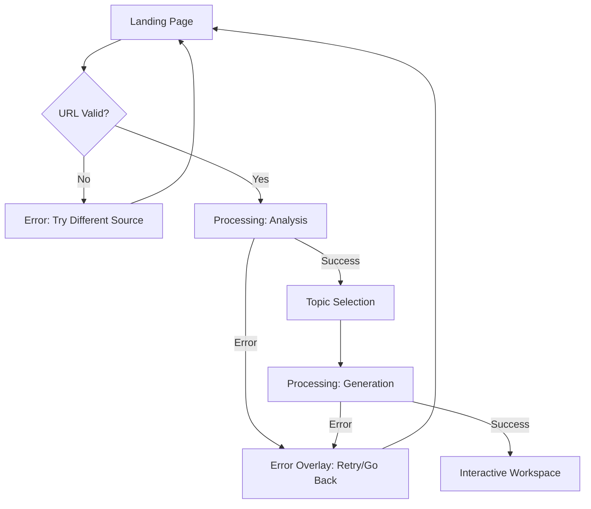

# Core Flows: Student Learning Journey

## Overview

This spec documents the core user flows for Studyfied's MVP, focusing on the **"Exam Panic" student journey** where a student transforms passive content into interactive learning experiences. All flows are designed for Guest mode (no authentication) with session-based state.

---

## Flow 1: Content Input & Topic Discovery

**Trigger:** Student lands on Studyfied homepage (exam panic, needs quick understanding)

**Journey:**

1. **Landing Page Entry**
  - Student sees hero section with URL input field and "Generate" button
  - Alternative path: "Or upload a PDF document" link visible below input
  - Student pastes Wikipedia URL for "Bernoulli's Principle" and clicks "Generate"
2. **Immediate Validation**
  - System validates URL format and accessibility
  - **If unsupported** (paywall, YouTube, unreadable): Show error message immediately with suggestion to "paste raw text instead" or "try a different source"
  - **If valid**: Proceed to processing
3. **Content Analysis (Processing Screen)**
  - Animated progress indicator shows: "Connecting to Librarian Agent...", "Parsing Semantic Structure...", "Identifying Key Topics..."
  - Duration: ~3-5 seconds
  - **Back button behavior**: If clicked, show confirmation dialog: "Generation in progress. Cancel?" with Yes/No options
  - **On error**: Show error overlay with "Retry" and "Go Back" buttons
4. **Topic Selection**
  - System presents 3 distinct topics extracted by Librarian Agent
  - Each topic card shows: Title, description, tags (e.g., "Core Concept", "Math Heavy"), estimated duration
  - One topic marked as "Recommended" with visual badge
  - Student clicks on "Bernoulli's Equation Usage" (the recommended topic)
5. **Lesson Generation (Processing Screen)**
  - New progress animation: "Activating Image Steering Agent...", "Synthesizing Assets (Parallel Execution)...", "Director Composing Scene Plan..."
  - Duration: ~45-60 seconds (target: <60s total)
  - Same back button and error handling as step 3
  - **On completion**: Navigate to Interactive Workspace

---

## Flow 2: Interactive Lesson Playback

**Trigger:** Lesson generation completes, student enters Workspace

**Journey:**

1. **Workspace Initial State**
  - Canvas displays first frame of whiteboard lesson (paused state)
  - Large play button overlay in center: "Tap to start"
  - Toolbar shows: Back button, lesson title "Bernoulli's Principle", player controls (disabled), quiz toggle (ON by default), layer controls, scribble mode button, transcript toggle
  - Transcript sidebar open on desktop, closed on mobile
  - Student clicks play button
2. **Active Playback**
  - Whiteboard animation begins: hand-drawn pipe appears, water particles flow, labels animate in sync with narration
  - Audio narration plays: "Imagine water flowing through a wide pipe that suddenly gets narrower..."
  - Transcript auto-scrolls, highlighting current line with timestamp
  - Player controls active: pause, skip forward/back, seek bar, time display (01:24 / 03:00)
  - **Transcript interaction**: Student can click any timestamp to jump to that moment
3. **Quiz Checkpoint (If Quiz Toggle ON)**
  - At AI-determined checkpoint (after concept explanation), lesson auto-pauses
  - Quiz overlay appears centered on canvas with question: "What happens to velocity in the narrow section?"
  - Two answer options displayed as clickable cards
  - Student selects "Velocity Increases"
  - **No immediate feedback** - answer is recorded silently, quiz overlay fades out
  - Lesson auto-resumes after 1 second
  - Student can toggle quiz mode OFF anytime via toolbar to skip future quizzes
4. **Annotation Mode**
  - Student pauses lesson and clicks "Edit" button in toolbar
  - Canvas cursor changes to crosshair, scribble mode activated
  - Student draws notes/highlights on canvas (orange marker color)
  - Annotations persist during session, visible in "My Notes" layer
  - **On resume**: Annotations remain visible (session-based persistence)
  - Student can toggle "My Notes" layer visibility via layer controls without deleting data
5. **Layer Controls**
  - Student clicks "Layers" button, dropdown shows: "AI Drawings" (visible), "My Notes" (visible)
  - Clicking visibility icon fades layer to 10% opacity (non-destructive)
  - Both layers can be toggled independently during playback or pause

---

## Flow 3: Lesson Completion & Next Steps

**Trigger:** Lesson playback reaches end (03:00 / 03:00)

**Journey:**

1. **Completion Overlay Appears**
  - Canvas shows final frame with completion overlay
  - Heading: "Lesson Complete! 🎉"
  - Quiz summary (if quizzes were enabled): "You answered 3 questions" (no correct/incorrect shown yet - saved for final report)
  - Three action buttons displayed:
    - **"Replay"**: Restart current lesson from beginning
    - **"Choose Another Topic"**: Return to topic selection (shows the other 2 topics from Librarian)
    - **"New Material"**: Return to landing page for new URL/PDF input
2. **Student Selects Action**
  - **If "Replay"**: Canvas resets to first frame, annotations cleared (new session), playback ready
  - **If "Choose Another Topic"**: Navigate to topic selection screen with remaining topics
  - **If "New Material"**: Navigate to landing page, session data cleared

---

## Flow 4: Error Recovery Flows

### 4A. Generation Failure

**Trigger:** AI pipeline fails during processing (Gemini timeout, asset generation error)

**Journey:**

1. Processing screen shows error overlay: "Generation failed. The AI service is temporarily unavailable."
2. Two buttons: "Retry" (restart generation with same input), "Go Back" (return to previous screen)
3. Student clicks "Retry" → processing restarts from current stage
4. Student clicks "Go Back" → returns to topic selection (if in generation phase) or landing page (if in analysis phase)

### 4B. Unsupported Content

**Trigger:** Student submits URL that fails validation

**Journey:**

1. Immediate error message appears below input field: "This content cannot be accessed (paywall/restricted). Please try a different source or paste raw text."
2. Input field remains populated, student can edit and resubmit
3. Alternative: Student clicks "Or upload a PDF document" link to switch input method

### 4C. No Topics Found

**Trigger:** Librarian Agent cannot extract meaningful topics from content

**Journey:**

1. After analysis processing, instead of topic selection, show message: "We couldn't identify clear learning topics in this content. Try a more structured source (textbook, Wikipedia, educational article)."
2. Button: "Try Different Content" → return to landing page

---

## Flow 5: Alternative Entry Points

### 5A. PDF Upload Flow

**Trigger:** Student clicks "Or upload a PDF document" on landing page

**Journey:**

1. Navigate to Source Selection screen
2. Two large cards: "Upload PDF" and "Paste Link"
3. Student clicks "Upload PDF" card → file picker opens
4. Student selects PDF file (<10MB limit enforced)
5. **If file too large**: Show error: "File must be under 10MB. Try a shorter document."
6. **If valid**: Proceed to Content Analysis (same as Flow 1, step 3)

### 5B. Direct Source Selection

**Trigger:** Student clicks "Or upload a PDF document" link on landing

**Journey:**

1. Navigate to Source Selection screen (same as 5A)
2. Student can choose either PDF upload or URL paste
3. For URL paste: Input field with "Paste URL" placeholder and arrow button
4. Student pastes URL and clicks arrow → proceed to validation and analysis

---

## Key Interaction Patterns

### Quiz Interaction Design

- **Trigger**: Auto-pause at AI checkpoints (only if quiz toggle ON)
- **Question Type**: Tricky but relevant to just-explained concept
- **Answer Recording**: Silent (no immediate correct/incorrect feedback)
- **Continuation**: Auto-resume after 1 second
- **Final Report**: All quiz interactions saved for end-of-session summary (post-MVP: show detailed report)

### Annotation Behavior

- **Activation**: Click "Edit" button (auto-pauses if playing)
- **Drawing**: Freehand scribble with orange marker
- **Persistence**: Session-based (survives pause/resume, cleared on new visit)
- **Clearing**: Automatic on new session, manual via layer toggle (fade to 10%)
- **Playback Conflict**: Scribble mode disabled during active playback

### Navigation Patterns

- **Back Button**: Always visible in toolbar, confirmation dialog during processing
- **Completion**: Explicit choice required (Replay / Choose Another / New Material)
- **Transcript Seeking**: Click timestamp → jump to that moment (like YouTube chapters)
- **Layer Visibility**: Non-destructive toggle (fade to 10%, data preserved)

---

## Mobile Considerations

- **Transcript**: Closed by default on mobile, opens as full-screen drawer
- **Player Controls**: Compact toolbar on mobile, full controls on hover during playback
- **Scribble Mode**: Touch-optimized (supports touch drawing)
- **Quiz Overlay**: Full-width on mobile, centered card on desktop
- **Completion Overlay**: Stacked buttons on mobile, horizontal on desktop

---

## Session State Management

**What Persists During Session:**

- Current lesson playback position
- User annotations (scribble layer)
- Quiz answers (for final report)
- Layer visibility preferences
- Transcript open/closed state

**What Clears Between Sessions:**

- All annotations
- Quiz history
- Playback position
- Generated lesson data (Guest mode - no storage)

---

## Success Metrics Alignment

These flows directly support the Epic Brief success criteria:

- **Time to Insight (<5 min)**: URL paste → Topic selection → Interactive lesson in <60s total
- **The Click Test**: Quiz interactions and annotation mode prove it's an app, not a video
- **Demo Impact**: Smooth flow from input to interactive moment showcases the innovation
- **Confidence Score**: Quiz checkpoints and annotation enable active learning, not passive watching

