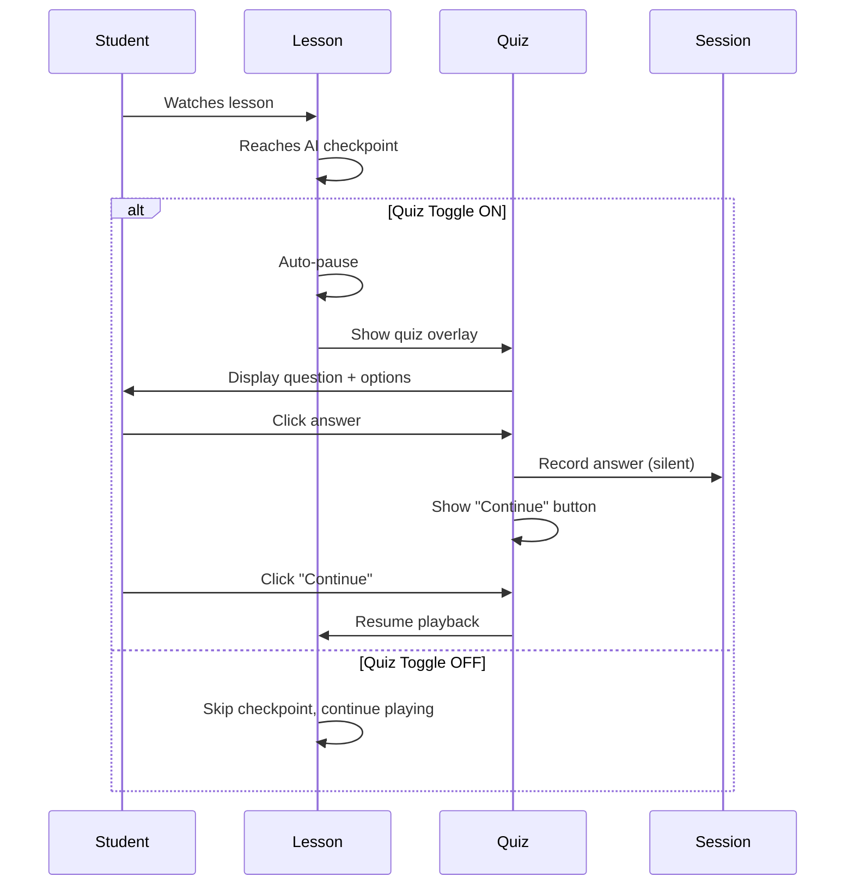

# Requirements Clarification & Validation Summary

## Overview

This document captures all requirements clarifications made during the validation phase of spec:509268fd-53cc-4271-8fce-6b32f347b891/6873d3a1-00d3-4b33-ad44-e3c26e718721 (Epic Brief) and spec:509268fd-53cc-4271-8fce-6b32f347b891/c0117da8-c026-4647-8654-58dae0da1be2 (Core Flows). These clarifications resolve ambiguities and fill gaps identified during validation, making the requirements implementation-ready.

**Validation Status:** ✅ **COMPLETE - Ready for Technical Architecture**

---

## Critical Clarifications

### 1. Quiz System Behavior

**Gap Identified:** Quiz final report was mentioned but never defined; auto-resume timing was too fast; toggle behavior unclear.

**Clarified Requirements:**

| Aspect                | Requirement                                                                                    |
| --------------------- | ---------------------------------------------------------------------------------------------- |
| **Final Report**      | Show simple summary on completion overlay: "You answered 3/5 questions correctly"              |
| **Auto-Resume**       | NO auto-resume - require explicit "Continue" button click after each quiz answer               |
| **Toggle Location**   | Prominent toggle button in main toolbar (same visual weight as scribble mode and layers)       |
| **Toggle Mid-Lesson** | When toggled OFF during playback, skip all future quiz checkpoints - lesson plays continuously |
| **Answer Feedback**   | Silent recording - no immediate correct/incorrect indication, only final score on completion   |

**Implementation Impact:**

- Quiz overlay must include "Continue" button (not just answer options)
- Toolbar design needs quiz toggle icon/button
- Quiz checkpoint logic must check toggle state before auto-pausing
- Completion overlay must calculate and display score (correct/total)

---

### 2. Session Lifecycle & Data Persistence

**Gap Identified:** "Session-based persistence" was mentioned but session boundaries were undefined.

**Clarified Requirement:**

**Session Definition:** Data persists until user explicitly clicks "New Material" button on completion overlay or navigates to landing page.

**What This Means:**

- ✅ **Persists:** Across page refreshes, browser tab switches, pause/resume, "Replay" action, "Choose Another Topic" action
- ❌ **Clears:** On "New Material" click, navigation to landing page, browser tab close

**Data Affected:**

- User annotations (scribble layer)
- Quiz answers and score
- Playback position
- Layer visibility preferences
- Transcript open/closed state

**Implementation Impact:**

- Use `sessionStorage` or `localStorage` with explicit clear on "New Material"
- Session ID tied to current lesson/topic
- Clear session data on landing page mount

---

### 3. Topic Count Variability & Content Constraints

**Gap Identified:** Specs assumed exactly 3 topics, but Librarian Agent output is variable.

**Clarified Requirements:**

| Constraint                 | Value                                                        |
| -------------------------- | ------------------------------------------------------------ |
| **Topic Count**            | Variable (1-5+ topics) - display whatever Librarian extracts |
| **Max Duration per Topic** | 3 minutes                                                    |
| **Max Images per Topic**   | 5 images                                                     |
| **Topic Selection UI**     | Dynamic grid layout - adapts to 1-5+ topics                  |

**Librarian Agent Guidance:**

- Extract as many distinct, teachable topics as exist in the content
- Each topic must be self-contained (explainable in ≤3 min with ≤5 visuals)
- If content has only 1 clear topic, show 1 topic
- If content has 7 topics, show all 7 (no artificial limit)
- Prioritize quality over quantity - don't force-split concepts

**Implementation Impact:**

- Topic selection grid must be responsive (1-column mobile, 2-3 column desktop)
- Director Agent must enforce 3-min and 5-image limits per topic
- Update file:docs/prompt-spec.md Librarian prompt to remove "3 topics" constraint

---

### 4. Teacher Use Case Scope

**Gap Identified:** Epic Brief listed both students and teachers as "Primary Users" but Core Flows only covered student journey.

**Clarified Requirement:**

**Teacher Scope for MVP:** OUT OF SCOPE

- **Ms. Sarah is a secondary persona** for context and future vision only
- **MVP focuses exclusively on student self-learning** (the "Exam Panic" journey)
- Teachers can use the platform as students do (no special teacher features)
- Teacher-specific features (dashboards, classroom management, lesson sharing) are post-hackathon

**Epic Brief Update:**

- Move Ms. Sarah to "Secondary Persona (Future Vision)" section
- Remove teacher pain points from "Current Pain Points"
- Update "The Engagement Gap" to focus on student problem only

---

### 5. Demo Strategy & Hackathon Presentation

**Gap Identified:** "Polished demo showcasing 2-3 STEM topics" was ambiguous - pre-generated or live?

**Clarified Requirement:**

**Demo Strategy:** **Live Generation** during hackathon presentation

- Paste a Wikipedia URL in real-time
- Show the 45-60 second generation process (processing screens with progress)
- Demonstrate interactive playback with quiz, annotation, and layer controls
- Emphasize speed and "wow factor" of real-time AI generation

**Preparation:**

- Test with 2-3 reliable URLs (Bernoulli's Principle, Covalent Bonding, Photosynthesis)
- Have backup pre-generated lessons in case of API failures during demo
- Practice the live demo flow to stay within time limits

**Success Metric Alignment:**

- Directly demonstrates "Time to Insight" (<5 min from URL to quiz)
- Proves "The Click Test" (live interaction during demo)
- Shows innovation vs. static video platforms

---

### 6. Generation Timeout & Progress Feedback

**Gap Identified:** Target generation time is <60s, but no timeout or long-running job handling specified.

**Clarified Requirement:**

**Timeout Policy:** NO hard timeout - keep showing progress until completion or failure

**Progress Feedback:**

- Show animated progress indicators with stage names (as per Core Flows)
- No "Taking longer than expected" warnings
- Trust the AI pipeline to complete or fail gracefully
- If generation fails, show error overlay with "Retry" and "Go Back" options

**Rationale:**

- Hackathon demo environment - prioritize completion over strict timeouts
- AI services (Gemini, Nano Banana) have their own timeouts
- Better UX to show progress than to timeout prematurely

**Implementation Impact:**

- No client-side timeout logic needed
- Backend should handle AI service timeouts and return errors
- Processing screen stays active until backend responds (success or error)

---

### 7. UI Element States & Visibility

**Gap Identified:** Scribble mode button state during playback was unclear.

**Clarified Requirements:**

| UI Element               | State During Playback                        | State When Paused |
| ------------------------ | -------------------------------------------- | ----------------- |
| **Scribble Mode Button** | Hidden                                       | Visible           |
| **Quiz Toggle**          | Visible (always)                             | Visible (always)  |
| **Layer Controls**       | Visible (always)                             | Visible (always)  |
| **Player Controls**      | Visible (compact on mobile, full on desktop) | Visible           |

**Scribble Mode Behavior:**

- Button only appears when lesson is paused
- Clicking scribble mode auto-pauses if currently playing
- Scribble mode disabled during active playback (no drawing while animating)

**Implementation Impact:**

- Conditional rendering: `{!isPlaying && <ScribbleModeButton />}`
- Toolbar layout must accommodate dynamic button visibility

---

## Updated Flow Specifications

### Quiz Interaction Flow (Refined)

**Key Changes from Original:**

- Added "Continue" button requirement (no 1-second auto-resume)
- Added quiz toggle state check
- Clarified silent answer recording

---

### Completion Flow (Refined)

**Trigger:** Lesson playback reaches end (duration complete)

**Steps:**

1. **Completion Overlay Appears**
  - Heading: "Lesson Complete! 🎉"
  - **Quiz Score Display** (if quiz toggle was ON): "You answered 3/5 questions correctly" (or "You answered 0 questions" if all skipped)
  - Three action buttons:
    - "Replay" → Restart lesson, clear annotations, reset quiz score
    - "Choose Another Topic" → Return to topic selection (other topics from same Librarian analysis)
    - "New Material" → Return to landing page, **clear all session data**
2. **Session Data Handling**
  - "Replay": Keep session, reset playback position and quiz score
  - "Choose Another Topic": Keep session, navigate to topic selection
  - "New Material": **Clear session storage**, navigate to landing page

---

### Topic Selection Flow (Refined)

**Trigger:** Librarian Agent completes content analysis

**Steps:**

1. **Variable Topic Count Handling**
  - If 1 topic found: Show single topic card with "Generate Lesson" button
  - If 2-5 topics found: Show grid of topic cards (responsive layout)
  - If 6+ topics found: Show scrollable grid of all topics
  - If 0 topics found: Show error (Flow 4C - No Topics Found)
2. **Topic Card Display**
  - Each card shows: Title, description, tags, estimated duration (≤3 min)
  - First topic marked "Recommended" (highest relevance score from Librarian)
  - Student clicks any topic → proceed to Lesson Generation
3. **Content Constraints Enforcement**
  - Librarian ensures each topic is ≤3 min of content
  - Director Agent generates ≤5 images per topic
  - If topic requires >5 images, Director must consolidate or use grid layouts

---

## Implementation Checklist

### Frontend Requirements

- [ ] Quiz overlay includes "Continue" button (not auto-resume)
- [ ] Toolbar includes prominent quiz toggle button
- [ ] Quiz toggle state checked before auto-pausing at checkpoints
- [ ] Completion overlay calculates and displays quiz score
- [ ] Session storage cleared on "New Material" action
- [ ] Topic selection grid adapts to 1-5+ topics dynamically
- [ ] Scribble mode button hidden during playback, visible when paused
- [ ] Processing screen shows progress indefinitely (no timeout)

### Backend Requirements

- [ ] Librarian Agent removes "3 topics" constraint - extracts variable count
- [ ] Director Agent enforces max 3 min duration per topic
- [ ] Director Agent enforces max 5 images per topic
- [ ] Quiz checkpoint placement logic (AI-determined after concept explanation)
- [ ] Session data structure supports quiz score tracking
- [ ] Error handling for generation failures (no timeout, rely on AI service errors)

### Prompt Engineering (file:docs/prompt-spec.md)

- [ ] Update Librarian prompt: Remove "3 topics" constraint, add "1-5+ topics" guidance
- [ ] Update Director prompt: Add max 3 min duration constraint
- [ ] Update Image Steering prompt: Add max 5 images per topic constraint
- [ ] Add quiz generation guidance: "Tricky but relevant to just-explained concept"

---

## Validation Summary

| Validation Dimension        | Status     | Notes                                                                     |
| --------------------------- | ---------- | ------------------------------------------------------------------------- |
| **Problem Definition**      | ✅ Complete | Teacher scope clarified (out of MVP), demo strategy defined               |
| **User Experience**         | ✅ Complete | All flows refined with explicit states, timings, and behaviors            |
| **Functional Requirements** | ✅ Complete | Content constraints, session lifecycle, quiz system fully specified       |
| **Edge Cases**              | ✅ Complete | Variable topic count, generation timeout, UI states all addressed         |
| **Hackathon Alignment**     | ✅ Complete | Live demo strategy, success metrics, judging criteria alignment confirmed |

---

## Next Steps

**Requirements Phase:** ✅ COMPLETE

**Ready for:**

1. **Technical Architecture** (workflow:271192ed-bf0b-4f43-9915-d77b9e7dbb04/tech-plan) - Design high-level technical approach for AI pipeline, canvas rendering, state management
2. **Ticket Breakdown** (workflow:271192ed-bf0b-4f43-9915-d77b9e7dbb04/ticket-breakdown) - Convert specs into actionable implementation tickets

**Reference Documents:**

- spec:509268fd-53cc-4271-8fce-6b32f347b891/6873d3a1-00d3-4b33-ad44-e3c26e718721 (Epic Brief)
- spec:509268fd-53cc-4271-8fce-6b32f347b891/c0117da8-c026-4647-8654-58dae0da1be2 (Core Flows)
- This document (Requirements Clarification & Validation Summary)
- file:docs/prd.md (Original PRD)
- file:docs/architecture.md (Technical architecture decisions)
- file:docs/prompt-spec.md (AI agent prompts - needs updates per checklist)

