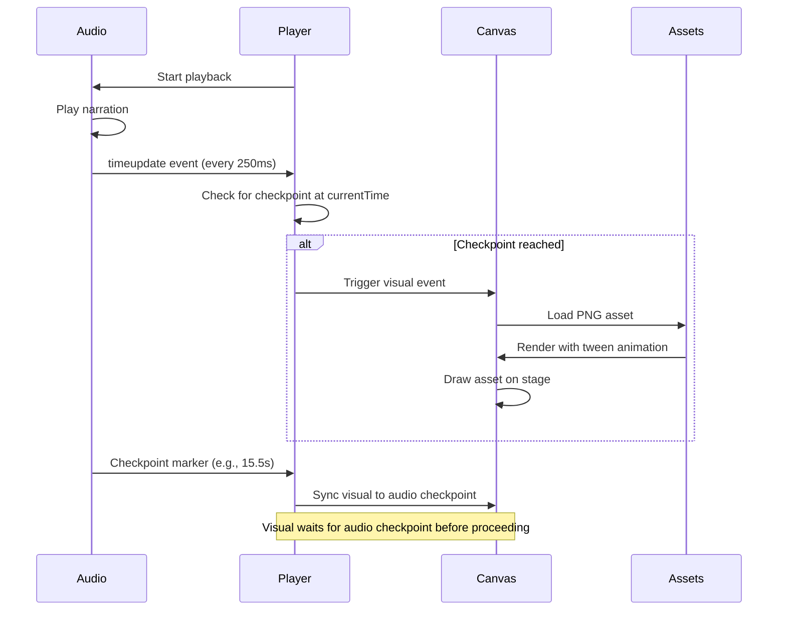
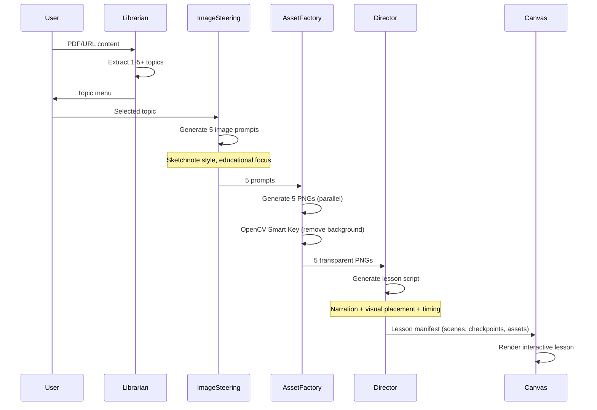

# Tech Plan: Canvas Rendering & AI Visual Pipeline (Refocused)

## Overview

This Tech Plan focuses on the **core innovation** of Studyfied: AI-generated personalized visual explanations rendered on an interactive canvas. The architecture prioritizes:

1. **Canvas Rendering & Audio-Visual Sync** (The Hero)
2. **AI Pipeline for Visual Explanations** (The Magic)
3. **Asset Quality & Hand-Drawn Aesthetic** (The Polish)
4. **Session Management** (Supporting Feature)
5. **Quiz System** (Minimal, Deprioritized)

**Foundation:** FastAPI (Python) + Vite + React + TypeScript + React-Konva + Zustand + IndexedDB

**Reference:** Extends file:docs/architecture.md with focus on visual learning experience.

---

## 1. Architectural Approach

### 1.1 Canvas Rendering & Audio-Visual Synchronization (PRIORITY 1)

**The Core Challenge:** Synchronizing narration audio with visual drawing events to create the "aha moment" where students **see** concepts being explained in real-time.

**Pattern:** Checkpoint-Based Synchronization ("Checkpoint Sync")

**Key Decisions:**


| Decision               | Choice                                 | Rationale                                                                      |
| ---------------------- | -------------------------------------- | ------------------------------------------------------------------------------ |
| **Rendering Engine**   | React-Konva (Canvas API wrapper)       | 60fps performance, declarative React patterns, proven for interactive graphics |
| **Sync Strategy**      | Checkpoint Sync (not frame-perfect)    | Audio checkpoints trigger visual events; simpler than frame-by-frame sync      |
| **Asset Type**         | Transparent PNG images (not SVG)       | Hand-drawn aesthetic from Nano Banana, OpenCV processing, faster rendering     |
| **Animation Approach** | Tween-based transitions between states | Smooth appearance of assets, controlled timing                                 |
| **Audio Engine**       | HTML5 Audio with event listeners       | Native browser support, precise timestamp events                               |


**Checkpoint Sync Architecture:**



**Implementation Strategy:**

1. **Lesson Manifest Structure:**
  ```typescript
   interface Scene {
     id: string;
     checkpointId: string;  // Links to audio checkpoint
     events: VisualEvent[];
   }

   interface VisualEvent {
     type: "draw" | "fadeIn" | "highlight" | "move";
     assetId: string;
     timestamp: number;  // Relative to scene start
     zone: "centerMain" | "leftSupport" | "rightNotes";
     params: { duration?: number; opacity?: number };
   }

   interface AudioCheckpoint {
     id: string;
     timestamp: number;  // Absolute time in seconds
     text: string;  // Narration text for this checkpoint
   }
  ```
2. **Sync Logic:**
  - Audio plays continuously
  - Player monitors `audio.currentTime`
  - At each checkpoint timestamp, trigger corresponding visual events
  - Visual events complete before next checkpoint (prevents drift)
3. **Performance:**
  - Pre-load all PNG assets into memory before playback
  - Use Konva's `batchDraw()` for efficient rendering
  - Target: 60fps during animation transitions

**Trade-offs:**

- ✅ **Pro**: Simpler than frame-perfect sync, more reliable
- ✅ **Pro**: Audio drives timing (natural pacing)
- ❌ **Con**: Not pixel-perfect sync (acceptable for educational content)

---

### 1.2 AI Pipeline for High-Quality Visual Explanations (PRIORITY 2)

**The Core Challenge:** Generating visual explanations that create the "aha moment" - making complex concepts visually clear.

**Pattern:** Multi-Agent Pipeline with Quality Gates

**AI Pipeline Architecture:**



**Quality Gates:**


| Stage              | Quality Check           | Action on Failure                                         |
| ------------------ | ----------------------- | --------------------------------------------------------- |
| **Librarian**      | Topics extracted?       | If 0 topics: Show error, request different content        |
| **Image Steering** | 5 prompts generated?    | Slice to first 5 if >5, pad with generic if <5            |
| **Asset Factory**  | All 5 images generated? | Retry failed images (max 1 retry), proceed with available |
| **Director**       | Valid lesson JSON?      | Pydantic validation, retry once, fail gracefully          |


**Prompt Engineering Focus (**file:docs/prompt-spec.md**):**

1. **Image Steering Agent:**
  - Emphasis: "Explanatory internal structure over icon-like simplicity"
  - Style: "Black-and-white sketchnote with teal/orange accents"
  - Constraint: "Exactly 5 image prompts"
  - Goal: Visual clarity for the "aha moment"
2. **AI Director Agent:**
  - Emphasis: "Khan Academy style narration - friendly, conversational, enthusiastic"
  - Sync: "Each narration block maps to a checkpoint"
  - Constraint: "Lesson duration ≤180 seconds"
  - Goal: Narration that explains WHILE drawing (synchronized)

**Trade-offs:**

- ✅ **Pro**: Multi-agent specialization improves quality
- ✅ **Pro**: Quality gates prevent broken lessons
- ❌ **Con**: More complex pipeline (5 stages)
- ❌ **Con**: Each stage adds latency (mitigated by parallel execution)

---

### 1.3 Asset Rendering Quality & Hand-Drawn Aesthetic (PRIORITY 3)

**The Core Challenge:** Rendering transparent PNG assets with hand-drawn aesthetic at 60fps while maintaining visual polish.

**Pattern:** Pre-processed Assets with Optimized Canvas Rendering

**Asset Pipeline:**

1. **Generation** (Gemini Images or OpenAI-compatible Images API):
  - Style: Sketchnote, black-and-white with teal/orange accents
  - Format: High-res 2K images (16:9 aspect ratio)
  - Output: Raw PNG with white background
2. **Processing** (OpenCV Smart Key):
  - Remove white background using HSV color space
  - Preserve teal/orange accents (Smart Key algorithm)
  - Output: Transparent PNG assets
  - Reference: file:docs/prd.md mentions "asset_pipeline_lessons_learned.md"
3. **Rendering** (React-Konva):
  - Load transparent PNGs as Konva Image nodes
  - Apply tween animations (fadeIn, scale, position)
  - Render at 60fps using `batchDraw()`
  - Layer management: AI layer + User annotation layer

**Rendering Optimization:**

```typescript
// Pseudocode for asset rendering
interface AssetRenderConfig {
  assetId: string;
  zone: "centerMain" | "leftSupport" | "rightNotes";
  scaleHint: "large" | "medium" | "small";
  animation: {
    type: "fadeIn" | "draw" | "highlight";
    duration: number;  // milliseconds
  };
}

// Pre-load all assets before playback
const preloadAssets = async (assets: Asset[]) => {
  const images = await Promise.all(
    assets.map(asset => loadImageFromBlob(asset.url))
  );
  return images;  // Cached in memory
};
```

**Visual Quality Checklist:**

- [ ] Transparent backgrounds (no white boxes)
- [ ] Teal/orange accents preserved
- [ ] Hand-drawn aesthetic maintained
- [ ] Smooth transitions (no jarring pops)
- [ ] 60fps rendering during animations
- [ ] Proper layering (AI content below annotations)

**Trade-offs:**

- ✅ **Pro**: PNG rendering is faster than SVG
- ✅ **Pro**: OpenCV processing ensures quality
- ❌ **Con**: Larger file sizes than SVG (mitigated by IndexedDB caching)

---

### 1.4 Session Management (PRIORITY 4)

**Pattern:** localStorage with Per-Lesson Isolation

**Simplified Approach:**

- Store: Annotations, playback position, layer preferences
- Scope: Per-lesson (isolated by lessonId)
- Lifecycle: Persist until "New Material"
- Tab enforcement: Single-tab with warning

**Key Components:**

- `sessionStore` (Zustand): Session metadata
- `session.ts` (lib): localStorage utilities
- `sessionMiddleware.ts`: Auto-sync with debouncing

**Details:** See spec:509268fd-53cc-4271-8fce-6b32f347b891/4c497b15-664c-45f2-987c-c0f0e86e9398 (Architecture Validation Report)

---

### 1.5 Quiz System (PRIORITY 5 - MINIMAL)

**Pattern:** Embedded Quizzes with Opt-In at Topic Selection

**Minimal Implementation:**

- Quiz opt-in checkbox at topic selection
- Quizzes embedded in lesson manifest (not separate API)
- Basic tap-to-answer with "Continue" button
- Simple score display on completion
- **No over-engineering** - implement AFTER core whiteboard experience

**Details:** See spec:509268fd-53cc-4271-8fce-6b32f347b891/4c497b15-664c-45f2-987c-c0f0e86e9398 (Architecture Validation Report)

---

## 2. Data Model

### 2.1 Lesson Manifest (Core Data Structure)

**The Central Schema:**

```typescript
interface LessonManifest {
  lessonId: string;
  topicTitle: string;
  duration: number;  // Seconds (≤180)
  
  // Visual content
  scenes: Scene[];
  assets: Asset[];  // Max 5 transparent PNGs
  
  // Audio content
  audioUrl: string;  // TTS audio blob URL
  checkpoints: AudioCheckpoint[];  // Sync points
  transcript: TranscriptLine[];
  
  // Optional interactivity
  quizzes?: QuizQuestion[];  // Empty if quiz disabled
}

interface Scene {
  id: string;
  purpose: string;  // "Introduce Bernoulli's equation"
  checkpointId: string;  // Links to audio checkpoint
  events: VisualEvent[];  // What to draw and when
}

interface VisualEvent {
  type: "fadeIn" | "highlight" | "move";
  assetId: string;  // References Asset.id
  timestamp: number;  // Relative to scene start
  zone: "centerMain" | "leftSupport" | "rightNotes" | "topHeader" | "bottomContext";
  scaleHint: "large" | "medium" | "small";
  params: Record<string, any>;  // Animation parameters
}

interface AudioCheckpoint {
  id: string;
  timestamp: number;  // Absolute time (seconds)
  text: string;  // Narration for TTS
}

interface Asset {
  id: string;
  url: string;  // blob: URL from IndexedDB
  type: "image" | "audio";
  metadata: {
    width: number;
    height: number;
    role: "primaryDiagram" | "supportingDiagram" | "prop" | "icon";
  };
}
```

**Design Principles:**

- **Declarative**: Describes WHAT to render, not HOW
- **Temporal**: Events have timestamps for synchronization
- **Semantic**: Zones and roles describe intent, not coordinates
- **Self-Contained**: All data needed for rendering included

---

### 2.2 Canvas State Model

**Player State:**

```typescript
interface PlayerState {
  isPlaying: boolean;
  currentTime: number;  // Seconds
  duration: number;
  currentScene: string | null;
  loadedAssets: Map<string, HTMLImageElement>;  // Pre-loaded images
}
```

**Annotation State:**

```typescript
interface AnnotationState {
  lines: Array<{ x: number; y: number }[]>;  // Scribble paths
  isScribbleMode: boolean;
  layerVisibility: {
    aiDrawings: boolean;
    myNotes: boolean;
  };
}
```

---

### 2.3 AI Pipeline Data Flow

**Input → Output Mapping:**


| Stage              | Input               | Output             | Format       |
| ------------------ | ------------------- | ------------------ | ------------ |
| **Librarian**      | Raw text (PDF/URL)  | Topic menu         | JSON array   |
| **Image Steering** | Selected topic text | 5 image prompts    | JSON array   |
| **Asset Factory**  | 5 image prompts     | 5 transparent PNGs | Binary blobs |
| **AI Director**    | Topic + 5 PNGs      | Lesson manifest    | JSON object  |


**Data Constraints:**

- Max 5 assets per lesson
- Max 180 seconds duration
- All JSON must be Pydantic-validated

---

## 3. Component Architecture

### 3.1 Canvas Rendering System (PRIORITY 1)

**Core Components:**

**Frontend:**

- `WhiteboardStage.tsx`: Main Konva Stage component
  - Manages canvas layers (AI layer, annotation layer)
  - Handles asset rendering and animations
  - Integrates with `playerStore` for playback state
- `AudioPlayer.tsx`: Audio playback controller
  - HTML5 Audio element
  - Emits checkpoint events
  - Syncs with canvas via `playerStore`
- `CanvasRenderer.ts`: Visual event executor
  - Interprets `VisualEvent` objects
  - Applies Konva tweens for animations
  - Manages asset positioning and scaling

**Stores:**

- `playerStore`: Playback state (playing, currentTime, currentScene)
- `lessonStore`: Lesson manifest and pre-loaded assets

**Data Flow:**

1. Lesson loads → Pre-load all PNG assets into memory
2. User clicks play → Audio starts
3. Audio emits `timeupdate` → Player checks for checkpoints
4. Checkpoint reached → Trigger visual events for that scene
5. Canvas renders events with tween animations
6. Repeat until lesson complete

**Performance Targets:**

- 60fps during animations
- <100ms latency from checkpoint to visual event
- Smooth transitions (no jarring pops)

---

### 3.2 AI Visual Explanation Pipeline (PRIORITY 2)

**Backend Services:**

**1. Librarian Service** (`backend/app/services/librarian.py`):

- Input: Raw text from PDF/URL
- Output: Topic menu (1-5+ topics)
- Prompt: file:docs/prompt-spec.md (Librarian Agent section)
- Update: Remove "3 topics" constraint

**2. Image Steering Service** (`backend/app/services/image_steering.py`):

- Input: Selected topic text
- Output: 5 image prompts (sketchnote style)
- Prompt: file:docs/prompt-spec.md (Image Steering section)
- Update: "Generate exactly 5 image prompts"
- Focus: Explanatory visuals that create "aha moments"

**3. Asset Factory Service** (`backend/app/services/asset_factory.py`):

- Input: 5 image prompts
- Process:
  1. Generate 5 images via Nano Banana Pro (parallel)
  2. Apply OpenCV Smart Key (remove white background, preserve accents)
  3. Output 5 transparent PNGs
- Constraint: `prompts[:5]` (slice to first 5 if >5 generated)

**4. AI Director Service** (`backend/app/services/ai_director.py`):

- Input: Topic text + 5 transparent PNGs
- Output: Lesson manifest (scenes, checkpoints, events)
- Prompt: file:docs/prompt-spec.md (Director section)
- Update: "Lesson duration ≤180 seconds"
- Focus: Narration synchronized with visual events

**Quality Emphasis:**

- Visual explanations must be **pedagogically sound** (not just pretty)
- Narration must **explain while drawing** (synchronized)
- Assets must have **explanatory internal structure** (not icon-like)

---

### 3.3 Asset Quality & Rendering (PRIORITY 3)

**Asset Processing Pipeline:**

**OpenCV Smart Key Algorithm:**

- Convert to HSV color space
- Define white background range: `H: 0-180, S: 0-30, V: 200-255`
- Define accent colors: Teal `H: 170-190`, Orange `H: 10-25`
- Remove white pixels, preserve accents and black lines
- Output: Transparent PNG with preserved colors

**Konva Rendering:**

```typescript
// Pseudocode for asset rendering
const renderAsset = (event: VisualEvent, asset: HTMLImageElement) => {
  const image = new Konva.Image({
    image: asset,
    x: calculatePosition(event.zone, event.scaleHint),
    y: calculatePosition(event.zone, event.scaleHint),
    opacity: 0,  // Start invisible
  });
  
  // Fade in animation
  const tween = new Konva.Tween({
    node: image,
    duration: event.params.duration || 0.5,
    opacity: 1,
    easing: Konva.Easings.EaseInOut,
  });
  
  layer.add(image);
  tween.play();
};
```

**Visual Quality Targets:**

- Hand-drawn aesthetic maintained
- Smooth fade-in transitions (0.5-1s)
- Proper layering (background → diagrams → labels → annotations)
- No visual artifacts from background removal

---

### 3.4 Session Persistence (PRIORITY 4)

**Simplified Approach:**

- localStorage with per-lesson keys: `studyfied_session_{lessonId}`
- Store: Annotations, playback position, layer preferences
- Single-tab enforcement with flag checking
- Loading state during hydration

**Details:** See spec:509268fd-53cc-4271-8fce-6b32f347b891/4c497b15-664c-45f2-987c-c0f0e86e9398

---

### 3.5 Quiz System (PRIORITY 5 - MINIMAL)

**Minimal Implementation:**

- Opt-in at topic selection
- Embedded in lesson manifest
- Basic overlay with "Continue" button
- Simple score calculation

**Implementation:** AFTER core whiteboard experience is complete.

**Details:** See spec:509268fd-53cc-4271-8fce-6b32f347b891/4c497b15-664c-45f2-987c-c0f0e86e9398

---

## Implementation Priority

### Phase 1: Core Whiteboard Experience (CRITICAL)

1. Canvas rendering system (React-Konva setup)
2. Audio-visual synchronization (Checkpoint Sync)
3. Asset loading and rendering (PNG with tweens)
4. AI pipeline (Librarian → Image Steering → Asset Factory → Director)
5. Basic playback controls (play, pause, seek)

### Phase 2: Interactive Canvas (HIGH)

1. Annotation mode (scribble layer)
2. Layer controls (toggle AI/Notes visibility)
3. Session persistence (save annotations, playback position)
4. Transcript with timestamp seeking

### Phase 3: Polish & Demo Prep (MEDIUM)

1. Visual quality refinement (hand-drawn aesthetic)
2. Audio-visual sync tuning (eliminate drift)
3. Error handling and loading states
4. Mobile responsiveness

### Phase 4: Minimal Quiz (LOW - OPTIONAL)

1. Quiz opt-in at topic selection
2. Basic quiz overlay
3. Simple score display
4. **Implement only if time permits**

---

## Critical Technical Challenges

### Challenge 1: Audio-Visual Sync Precision

**Problem:** Audio and visual must stay synchronized throughout 3-minute lesson.

**Solution:** Checkpoint Sync pattern

- Audio checkpoints at key moments (every 10-20 seconds)
- Visual events wait for checkpoint before executing
- Prevents cumulative drift

**Testing:** Play lesson 10 times, verify sync stays within 500ms tolerance.

---

### Challenge 2: 60fps Canvas Performance

**Problem:** Rendering multiple PNG assets with animations at 60fps.

**Solution:**

- Pre-load all assets before playback
- Use Konva's `batchDraw()` for efficient updates
- Limit concurrent animations (max 2-3 simultaneous tweens)
- Use `requestAnimationFrame` for smooth updates

**Testing:** Monitor FPS during playback, optimize if <60fps.

---

### Challenge 3: AI-Generated Visual Quality

**Problem:** AI must generate visuals that create "aha moments", not just decorative images.

**Solution:**

- Detailed prompt engineering (file:docs/prompt-spec.md)
- Emphasis on "explanatory internal structure"
- Manual testing with 5-10 different STEM topics
- Iterate prompts based on visual quality

**Testing:** Show generated lessons to 3-5 students, ask "Did this help you understand?"

---

## References

- **Existing Architecture**: file:docs/architecture.md
- **Requirements**: spec:509268fd-53cc-4271-8fce-6b32f347b891/c52baee0-3a4b-4823-9c6e-2a077684ef50
- **Core Flows**: spec:509268fd-53cc-4271-8fce-6b32f347b891/c0117da8-c026-4647-8654-58dae0da1be2
- **Prompts**: file:docs/prompt-spec.md
- **UI Mockup**: file:docs/code.html

