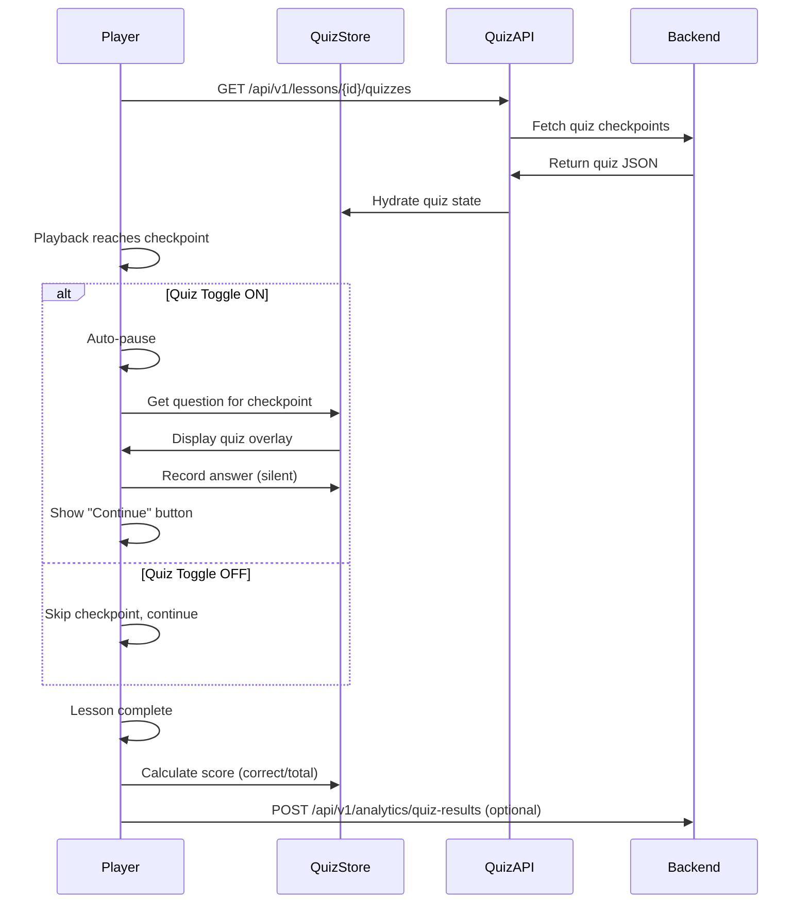
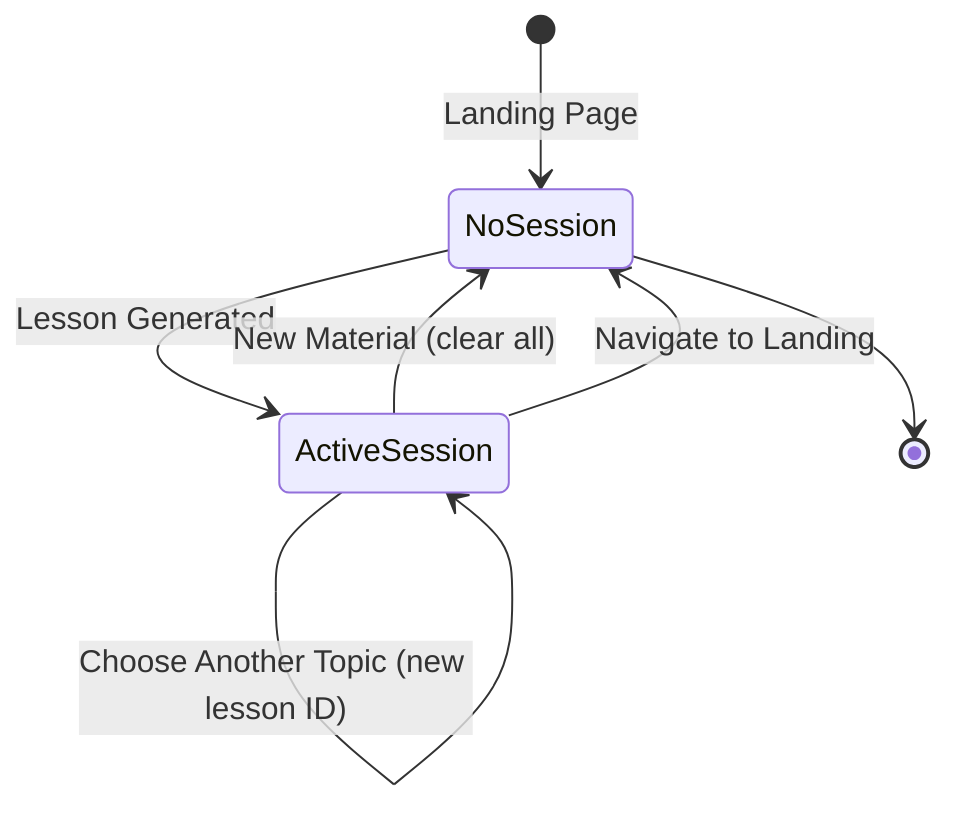
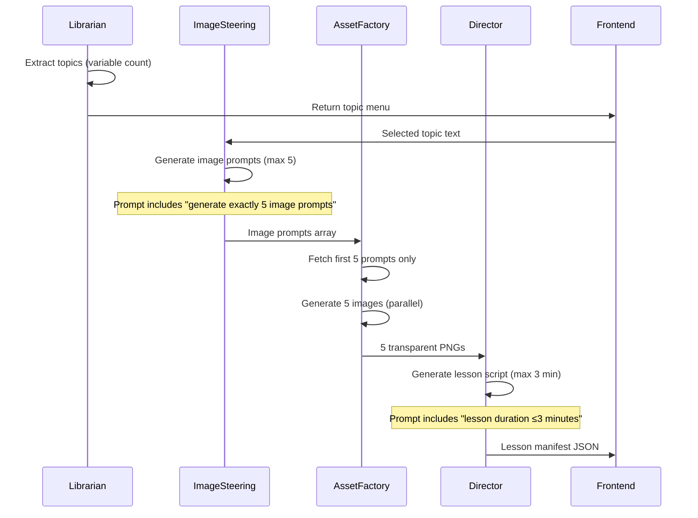

# Tech Plan: Quiz System, Session Management & AI Constraints

## Overview

This Tech Plan extends the existing architecture (file:docs/architecture.md) to support three critical features validated in spec:509268fd-53cc-4271-8fce-6b32f347b891/c52baee0-3a4b-4823-9c6e-2a077684ef50:

1. **Quiz System** - Interactive quizzes with toggle control, silent feedback, and completion scoring
2. **Session Management** - Per-lesson state persistence using localStorage
3. **AI Pipeline Constraints** - Soft enforcement of max 3 min duration and max 5 images per topic

**Foundation:** FastAPI (Python) + Vite + React + TypeScript + React-Konva + Zustand + IndexedDB

---

## 1. Architectural Approach

### 1.1 Quiz System Architecture

**Pattern:** Separate API Endpoint with Lazy Loading

**Key Decisions:**


| Decision               | Choice                                                       | Rationale                                                                                              |
| ---------------------- | ------------------------------------------------------------ | ------------------------------------------------------------------------------------------------------ |
| **Quiz Data Location** | Separate API endpoint (`/api/v1/lessons/{lessonId}/quizzes`) | Decouples quiz generation from lesson generation; enables independent caching and updates              |
| **Quiz Scoring**       | Dual: Frontend (immediate) + Backend (analytics)             | Frontend calculates score for instant display; backend receives answers for future analytics/reporting |
| **State Management**   | Dedicated `quizStore` (Zustand)                              | Isolates quiz state from player state; cleaner separation of concerns                                  |
| **Quiz Toggle**        | Toolbar UI control synced to `quizStore.enabled`             | Prominent placement as validated; state persists in session                                            |


**Data Flow:**



**Trade-offs:**

- ✅ **Pro**: Separate endpoint enables quiz updates without regenerating entire lesson
- ✅ **Pro**: Lazy loading reduces initial lesson load time
- ❌ **Con**: Additional API call adds latency (mitigated by parallel loading)
- ❌ **Con**: Requires quiz-lesson ID mapping

**Constraint:** Quiz data must reference lesson checkpoint IDs for synchronization.

---

### 1.2 Session Management Architecture

**Pattern:** localStorage with Per-Lesson Isolation

**Key Decisions:**


| Decision              | Choice                                   | Rationale                                                                  |
| --------------------- | ---------------------------------------- | -------------------------------------------------------------------------- |
| **Storage Mechanism** | `localStorage` (not `sessionStorage`)    | Persists across tab closes; cleared only on explicit "New Material" action |
| **Session Scope**     | Per-lesson (isolated by lesson ID)       | Annotations for Lesson A don't appear in Lesson B; cleaner UX              |
| **Session ID**        | `studyfied_session_{lessonId}`           | Namespaced keys prevent collisions; easy to clear specific lessons         |
| **State Sync**        | Zustand middleware syncs to localStorage | Automatic persistence; no manual save/load logic in components             |


**Session Lifecycle:**



**Data Persisted Per Session:**

- Playback position (timestamp)
- User annotations (scribble layer paths)
- Quiz answers and score
- Layer visibility preferences (AI Drawings, My Notes)
- Transcript open/closed state
- Quiz toggle enabled/disabled

**Trade-offs:**

- ✅ **Pro**: Survives browser crashes and tab closes
- ✅ **Pro**: Per-lesson isolation prevents data leakage
- ❌ **Con**: localStorage has 5-10MB limit (mitigated by storing only metadata, not assets)
- ❌ **Con**: Manual cleanup required on "New Material"

**Constraint:** Session data must be serializable to JSON (no functions, no circular references).

---

### 1.3 AI Pipeline Constraints Architecture

**Pattern:** Soft Constraint Enforcement via Prompt Engineering

**Key Decisions:**


| Decision            | Choice                                                            | Rationale                                                      |
| ------------------- | ----------------------------------------------------------------- | -------------------------------------------------------------- |
| **Constraint Type** | Soft (prompt-level)                                               | Faster generation; trusts AI to comply; simpler implementation |
| **Image Count**     | Image Steering generates ≤5 prompts; backend fetches first 5 only | Fail-safe: even if 6 prompts generated, only 5 images created  |
| **Duration**        | AI Director prompt includes "max 3 min" guidance                  | Soft constraint; no hard validation (trust AI)                 |
| **Validation**      | None (for MVP)                                                    | Prioritizes speed over strict enforcement                      |


**AI Pipeline Flow (Updated):**



**Constraint Enforcement Points:**

1. **Image Steering Prompt** (file:docs/prompt-spec.md):
  - Update: "Generate exactly 5 image prompts (no more, no less)"
  - Existing: Grid layouts for multi-concept visuals
2. **Asset Factory Logic**:
  - `image_prompts = image_prompts[:5]` (Python slice to first 5)
  - Parallel generation of exactly 5 images
3. **AI Director Prompt** (file:docs/prompt-spec.md):
  - Update: "Lesson duration must not exceed 180 seconds (3 minutes)"
  - Update: "Use all 5 provided images efficiently"

**Trade-offs:**

- ✅ **Pro**: Fast generation (no validation overhead)
- ✅ **Pro**: Simple implementation (no retry logic)
- ❌ **Con**: No guarantee of compliance (AI might generate 4 min lesson)
- ❌ **Con**: No feedback if constraints violated

**Mitigation:** For hackathon demo, manually test with 2-3 URLs to ensure prompts work. Post-MVP can add hard validation.

---

### 1.4 State Management Architecture

**Pattern:** Multiple Feature-Specific Zustand Stores

**Store Separation:**


| Store          | Responsibility                                        | Persistence                  |
| -------------- | ----------------------------------------------------- | ---------------------------- |
| `playerStore`  | Playback state (playing, currentTime, duration)       | Session (via middleware)     |
| `quizStore`    | Quiz state (questions, answers, score, toggle)        | Session (via middleware)     |
| `sessionStore` | Session metadata (lessonId, annotations, preferences) | localStorage (direct)        |
| `lessonStore`  | Lesson data (manifest, assets, transcript)            | IndexedDB (via `idb-keyval`) |


**Rationale:**

- **Separation of Concerns**: Each store has single responsibility
- **Independent Updates**: Quiz toggle doesn't trigger player re-renders
- **Selective Persistence**: Only `sessionStore` and `quizStore` sync to localStorage
- **Performance**: Smaller stores = faster updates, less re-rendering

**Trade-offs:**

- ✅ **Pro**: Clean boundaries, easier to test
- ✅ **Pro**: Selective re-rendering (better performance)
- ❌ **Con**: More boilerplate (4 stores vs 1)
- ❌ **Con**: Cross-store communication requires careful design

**Constraint:** Stores must not create circular dependencies (e.g., `playerStore` → `quizStore` → `playerStore`).

---

## 2. Data Model

### 2.1 Quiz Data Structures

**Backend Schema (Pydantic):**

```python
# backend/app/schemas/quiz.py
from pydantic import BaseModel, Field
from typing import List

class QuizOption(BaseModel):
    id: str
    text: str
    is_correct: bool = Field(alias="isCorrect")

class QuizQuestion(BaseModel):
    id: str
    checkpoint_id: str = Field(alias="checkpointId")  # Links to lesson checkpoint
    question_text: str = Field(alias="questionText")
    options: List[QuizOption]
    explanation: str | None = None  # Optional, for future use

class QuizCheckpoint(BaseModel):
    lesson_id: str = Field(alias="lessonId")
    questions: List[QuizQuestion]

class QuizAnswer(BaseModel):
    question_id: str = Field(alias="questionId")
    selected_option_id: str = Field(alias="selectedOptionId")
    timestamp: int  # When answered (for analytics)

class QuizResult(BaseModel):
    lesson_id: str = Field(alias="lessonId")
    answers: List[QuizAnswer]
    score: int  # Correct count
    total: int  # Total questions
```

**Frontend Types (TypeScript):**

```typescript
// frontend/src/types/quiz.ts
export interface QuizOption {
  id: string;
  text: string;
  isCorrect: boolean;
}

export interface QuizQuestion {
  id: string;
  checkpointId: string;
  questionText: string;
  options: QuizOption[];
  explanation?: string;
}

export interface QuizAnswer {
  questionId: string;
  selectedOptionId: string;
  timestamp: number;
}

export interface QuizState {
  questions: QuizQuestion[];
  answers: QuizAnswer[];
  enabled: boolean;  // Quiz toggle state
  score: { correct: number; total: number } | null;
}
```

---

### 2.2 Session Data Structure

**localStorage Schema:**

```typescript
// Key: studyfied_session_{lessonId}
interface SessionData {
  lessonId: string;
  playbackPosition: number;  // Seconds
  annotations: {
    lines: Array<{ x: number; y: number }[]>;  // Scribble paths
  };
  quizAnswers: QuizAnswer[];
  quizScore: { correct: number; total: number } | null;
  layerVisibility: {
    aiDrawings: boolean;
    myNotes: boolean;
  };
  transcriptOpen: boolean;
  quizEnabled: boolean;
  lastUpdated: number;  // Timestamp
}
```

**Session Metadata (Global):**

```typescript
// Key: studyfied_current_session
interface CurrentSession {
  lessonId: string | null;  // Currently active lesson
  createdAt: number;
}
```

---

### 2.3 Lesson Manifest Structure (Updated)

**Lesson JSON (Generated by AI Director):**

```typescript
interface LessonManifest {
  lessonId: string;
  topicTitle: string;
  duration: number;  // Seconds (≤180)
  scenes: Scene[];
  checkpoints: Checkpoint[];  // Quiz checkpoint references
  assets: Asset[];  // Max 5 images
  transcript: TranscriptLine[];
}

interface Checkpoint {
  id: string;
  timestamp: number;  // When to pause for quiz
  type: "quiz" | "reflection";  // Future: other interaction types
}

interface Asset {
  id: string;
  url: string;  // blob: URL from IndexedDB
  type: "image" | "audio";
}
```

**Integration:** `checkpoints` array links to quiz questions via `checkpointId`.

---

### 2.4 IndexedDB Schema (Existing, No Changes)

**Database:** `studyfied-assets`

**Object Stores:**

- `lessons`: Stores lesson manifests (key: lessonId)
- `assets`: Stores image/audio blobs (key: assetId)

**Note:** Quiz data is NOT stored in IndexedDB (fetched from API, cached in memory).

---

## 3. Component Architecture

### 3.1 Quiz System Components

**New Backend Endpoints:**


| Endpoint                             | Method | Purpose                                  |
| ------------------------------------ | ------ | ---------------------------------------- |
| `/api/v1/lessons/{lessonId}/quizzes` | GET    | Fetch quiz questions for lesson          |
| `/api/v1/analytics/quiz-results`     | POST   | Submit quiz results (optional analytics) |


**Backend Service:**

- `backend/app/services/quiz_generator.py`: Generates quiz questions based on lesson content
  - Input: Lesson topic text + lesson manifest
  - Output: `QuizCheckpoint` with questions linked to checkpoints
  - Uses Gemini API with quiz generation prompt

**Frontend Components:**

- `frontend/src/features/player/components/QuizOverlay.tsx`: Quiz UI overlay
  - Displays question and options
  - "Continue" button (no auto-resume)
  - Integrates with `quizStore`
- `frontend/src/features/player/components/QuizToggle.tsx`: Toolbar toggle button
  - Prominent placement in toolbar
  - Syncs with `quizStore.enabled`

**Frontend Stores:**

- `frontend/src/stores/quizStore.ts`: Quiz state management
  - Actions: `loadQuizzes()`, `recordAnswer()`, `calculateScore()`, `toggleQuiz()`
  - Middleware: Syncs to localStorage

**Data Flow:**

1. Lesson loads → Player fetches quizzes via `/api/v1/lessons/{id}/quizzes`
2. Quizzes hydrate `quizStore`
3. Playback reaches checkpoint → Check `quizStore.enabled`
4. If enabled → Pause, show `QuizOverlay`
5. User answers → `quizStore.recordAnswer()`
6. User clicks "Continue" → Resume playback
7. Lesson complete → `quizStore.calculateScore()` → Display on completion overlay
8. (Optional) Submit to `/api/v1/analytics/quiz-results`

---

### 3.2 Session Management Components

**Frontend Session Layer:**

- `frontend/src/lib/session.ts`: Session persistence utilities
  - `saveSession(lessonId, data)`: Writes to localStorage
  - `loadSession(lessonId)`: Reads from localStorage
  - `clearSession(lessonId)`: Deletes session data
  - `clearAllSessions()`: Clears all lesson sessions (on "New Material")

**Zustand Middleware:**

- `frontend/src/stores/middleware/sessionMiddleware.ts`: Auto-sync to localStorage
  - Listens to `playerStore`, `quizStore`, `sessionStore` changes
  - Debounces writes (max 1 write per second)
  - Serializes state to `SessionData` format

**Integration Points:**


| Component                                        | Session Action                                 |
| ------------------------------------------------ | ---------------------------------------------- |
| `Workspace.tsx` (mount)                          | `loadSession(lessonId)` → Hydrate stores       |
| `Workspace.tsx` (unmount)                        | `saveSession(lessonId, state)`                 |
| `CompletionOverlay.tsx` ("New Material")         | `clearAllSessions()`                           |
| `CompletionOverlay.tsx` ("Replay")               | `clearSession(lessonId)` → Reset playback only |
| `CompletionOverlay.tsx` ("Choose Another Topic") | Keep session, navigate to topics               |


**Session Lifecycle Hooks:**

```typescript
// Pseudocode for session integration
useEffect(() => {
  // On workspace mount
  const session = loadSession(lessonId);
  if (session) {
    playerStore.setState({ currentTime: session.playbackPosition });
    quizStore.setState({ answers: session.quizAnswers });
    sessionStore.setState({ annotations: session.annotations });
  }

  // On workspace unmount
  return () => {
    saveSession(lessonId, {
      playbackPosition: playerStore.currentTime,
      quizAnswers: quizStore.answers,
      annotations: sessionStore.annotations,
      // ... other state
    });
  };
}, [lessonId]);
```

---

### 3.3 AI Pipeline Constraint Components

**Backend Updates:**

**1. Image Steering Service** (`backend/app/services/image_steering.py`):

- Update prompt (file:docs/prompt-spec.md) to include: "Generate exactly 5 image prompts"
- No code changes (prompt-only update)

**2. Asset Factory Service** (`backend/app/services/asset_factory.py`):

- Add constraint enforcement:
  ```python
  def generate_assets(image_prompts: List[str]) -> List[Asset]:
      # Enforce max 5 images
      prompts_to_use = image_prompts[:5]
      
      # Parallel generation
      assets = await asyncio.gather(*[
          generate_single_asset(prompt) 
          for prompt in prompts_to_use
      ])
      
      return assets
  ```

**3. AI Director Service** (`backend/app/services/ai_director.py`):

- Update prompt (file:docs/prompt-spec.md) to include: "Lesson duration must not exceed 180 seconds (3 minutes)"
- Add assertion (optional, for debugging):
  ```python
  def generate_lesson(topic: str, assets: List[Asset]) -> LessonManifest:
      assert len(assets) <= 5, f"Expected ≤5 assets, got {len(assets)}"
      # ... existing logic
  ```

**Prompt Updates Required (**file:docs/prompt-spec.md**):**


| Agent              | Current Constraint    | New Constraint                  |
| ------------------ | --------------------- | ------------------------------- |
| **Librarian**      | "3 topics"            | "1-5+ topics (variable)"        |
| **Image Steering** | "4 specific + 1 grid" | "Exactly 5 image prompts total" |
| **AI Director**    | None                  | "Lesson duration ≤180 seconds"  |


**No Frontend Changes:** Constraints are backend-only.

---

### 3.4 Component Boundaries & Integration

**Boundary Map:**

```
Frontend (React)
├── features/player/
│   ├── components/
│   │   ├── WhiteboardStage.tsx (existing)
│   │   ├── QuizOverlay.tsx (NEW)
│   │   ├── QuizToggle.tsx (NEW)
│   │   └── CompletionOverlay.tsx (updated: quiz score display)
│   └── hooks/
│       └── useQuizCheckpoints.ts (NEW: detects checkpoints)
├── stores/
│   ├── playerStore.ts (existing)
│   ├── quizStore.ts (NEW)
│   ├── sessionStore.ts (NEW)
│   └── lessonStore.ts (existing)
└── lib/
    ├── session.ts (NEW: localStorage utilities)
    └── db.ts (existing: IndexedDB wrapper)

Backend (FastAPI)
├── app/routers/
│   ├── lessons.py (existing)
│   └── quizzes.py (NEW: quiz endpoints)
├── app/services/
│   ├── quiz_generator.py (NEW)
│   ├── image_steering.py (updated: prompt)
│   ├── asset_factory.py (updated: constraint)
│   └── ai_director.py (updated: prompt)
└── app/schemas/
    └── quiz.py (NEW: quiz data models)
```

**Cross-Boundary Communication:**

1. **Quiz System**: Frontend → `/api/v1/lessons/{id}/quizzes` → Backend
2. **Session Management**: Frontend ↔ localStorage (no backend)
3. **AI Constraints**: Backend-only (prompt engineering)

**Integration Sequence:**

1. **Lesson Load**: Fetch lesson manifest + quizzes in parallel
2. **Playback**: Player checks `quizStore.enabled` at each checkpoint
3. **Quiz Interaction**: `QuizOverlay` → `quizStore.recordAnswer()` → localStorage
4. **Completion**: Calculate score → Display → (Optional) POST to analytics
5. **Session Persistence**: Middleware auto-saves on state changes

---

## Implementation Notes

### Critical Path

1. **Quiz System**: Implement `quizStore` and `QuizOverlay` first (blocks interactive demo)
2. **Session Management**: Implement `sessionMiddleware` second (enables persistence)
3. **AI Constraints**: Update prompts last (soft enforcement, low risk)

### Testing Strategy

- **Quiz System**: Unit test `quizStore` actions, integration test quiz API
- **Session Management**: Test localStorage sync, session lifecycle
- **AI Constraints**: Manual testing with 2-3 URLs (verify ≤5 images, ≤3 min)

### Performance Considerations

- **Quiz Loading**: Parallel fetch with lesson manifest (no blocking)
- **Session Writes**: Debounced (max 1 write/sec) to avoid localStorage thrashing
- **Store Updates**: Selective re-rendering via Zustand selectors

### Failure Modes


| Failure                   | Recovery                                             |
| ------------------------- | ---------------------------------------------------- |
| Quiz API fails            | Disable quiz toggle, show warning, continue playback |
| localStorage full         | Fallback to in-memory only, warn user                |
| AI generates 6 images     | Backend slices to 5, no error                        |
| AI generates 4 min lesson | Allow (soft constraint), log warning                 |


---

## References

- **Existing Architecture**: file:docs/architecture.md
- **Requirements**: spec:509268fd-53cc-4271-8fce-6b32f347b891/c52baee0-3a4b-4823-9c6e-2a077684ef50
- **Prompts to Update**: file:docs/prompt-spec.md
- **Core Flows**: spec:509268fd-53cc-4271-8fce-6b32f347b891/c0117da8-c026-4647-8654-58dae0da1be2

