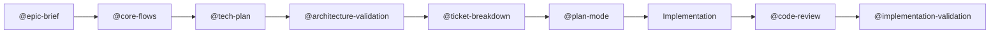

# Studyfied - AI Visual Learning Engine

**Transform static educational content into interactive, whiteboard-style video lessons in under 60 seconds.**

## 🎯 The Problem

Students struggle to build mental models from static textbooks and PDFs. Reading dense text doesn't create the visual connections needed for deep understanding. Traditional video platforms offer pre-recorded content that can't adapt to individual learning materials.

## 💡 The Solution

Studyfied uses AI to generate **personalized, interactive visual lessons** from any URL or PDF:
- 📝 **Paste a URL or upload a PDF** → AI analyzes the content
- 🎨 **AI generates sketch-note visuals** → Custom illustrations for your topic
- 🎬 **Interactive canvas lesson** → Watch concepts come alive with synchronized narration
- ✏️ **Pause, annotate, engage** → It's an app, not a video - interact with the content

## 🚀 The Innovation

**Interactive Canvas vs Static Videos:**
- Real-time React application (not pre-rendered video files)
- Pause and annotate directly on the canvas
- Adjust playback speed, seek via transcript
- Session persistence - your notes survive page refresh

**Personalized vs Pre-recorded:**
- AI generates content specific to YOUR material
- 60-second generation time from URL to interactive lesson
- No library of pre-made videos - everything is custom

**Novel Audio-Visual Sync Pattern:**
- Checkpoint Sync: Audio drives visual timing at sentence boundaries
- Zero drift over 3-minute lessons (±500ms tolerance)
- Smooth 60fps canvas rendering

## Architecture Overview

Studyfied is a polyglot monorepo with:

- **Frontend**: Vite + React + TypeScript with TailwindCSS and Konva.js for canvas rendering
- **Backend**: FastAPI + Python for AI processing pipeline
- **Storage**: Client-side IndexedDB for stateless backend architecture

```
┌─────────────────────────────────────────────────────────────┐
│                     Docker Compose                          │
├─────────────────────────┬───────────────────────────────────┤
│   Frontend (port 5173)  │      Backend (port 8000)          │
│   ┌─────────────────┐   │   ┌─────────────────────────────┐ │
│   │  Vite + React   │   │   │  FastAPI + Python           │ │
│   │  + TypeScript   │◄──┼──►│  + Pydantic                 │ │
│   │  + TailwindCSS  │   │   │  + AI Services              │ │
│   │  + Konva.js     │   │   └─────────────────────────────┘ │
│   └─────────────────┘   │                                   │
└─────────────────────────┴───────────────────────────────────┘
```

## Prerequisites

- [Docker](https://docs.docker.com/get-docker/) (v20.10+)
- [Docker Compose](https://docs.docker.com/compose/install/) (v2.0+)
- [Node.js](https://nodejs.org/) (v20+) - for local frontend development
- [Python](https://www.python.org/) (v3.11+) - for local backend development

## 🎥 Demo Instructions for Judges

**5-Minute Demo Flow:**

1. **Start Services** (30 seconds)
   ```bash
   docker-compose up --build
   ```
   Wait for: "Frontend ready at http://localhost:5173"

2. **Landing Page** (http://localhost:5173)
   - Click "Get Started" or paste a URL directly
   - **Example URL**: `https://en.wikipedia.org/wiki/Bernoulli%27s_principle`

3. **Watch AI Processing** (~60 seconds)
   - Stage 1: Analyzing content (10s) - Extracts key concepts
   - Stage 2: Generating visuals (40s) - Creates 5 custom illustrations
   - Stage 3: Creating lesson (10s) - Synthesizes narration and timing

4. **Select Topic** (5 seconds)
   - See AI-generated topics with visual potential scores
   - Click any topic card to start lesson

5. **Interactive Lesson Experience** (2 minutes)
   - ▶️ Press Play - Watch whiteboard animation with narration
   - ⏸️ Press Pause - Playback stops, "Annotate" button appears
   - ✏️ Click "Annotate" - Draw on canvas with orange marker
   - ▶️ Resume - Your annotations persist during playback
   - 👁️ Toggle "AI Drawings" layer - Fade to 10% opacity
   - 📝 Click transcript timestamp - Seek to that moment
   - ⚡ Adjust playback speed - 0.5x, 1x, 1.5x, 2x

6. **Key Demo Points to Highlight**
   - "This is NOT a video file - it's a React application rendering in real-time"
   - "Everything is personalized - paste YOUR content, get YOUR lesson"
   - "60-second generation time - instant gratification"
   - "Annotations prove interactivity - try doing this with a YouTube video!"

**Backup Demo URLs:**
- `https://en.wikipedia.org/wiki/Photosynthesis`
- `https://en.wikipedia.org/wiki/Newton%27s_laws_of_motion`
- `https://en.wikipedia.org/wiki/Supply_and_demand`

## Quick Start

1. **Clone the repository**
   ```bash
   git clone <repository-url>
   cd studyfied
   ```

2. **Set up environment variables**
   ```bash
   cp .env.example .env
   # Edit .env and add your API keys
   ```

3. **Start the development environment**
   ```bash
   docker-compose up --build
   ```

4. **Access the application**
   - Frontend: http://localhost:5173
   - Backend API: http://localhost:8000
   - API Documentation: http://localhost:8000/docs

## Development Workflow

### Starting Services

```bash
# Start all services
docker-compose up

# Start in detached mode
docker-compose up -d

# Rebuild after dependency changes
docker-compose up --build
```

### Viewing Logs

```bash
# View all logs
docker-compose logs -f

# View frontend logs only
docker-compose logs -f frontend

# View backend logs only
docker-compose logs -f backend
```

### Running Commands in Containers

```bash
# Frontend: Install a new package
docker-compose exec frontend npm install <package-name>

# Backend: Run a Python command
docker-compose exec backend python -c "print('Hello')"
```

### Stopping Services

```bash
# Stop all services
docker-compose down

# Stop and remove volumes
docker-compose down -v
```

## 🤖 Kiro CLI Integration

This project demonstrates extensive use of **Kiro CLI** for AI-assisted development workflow.

### Custom Workflow

We created 8 custom Kiro prompts tailored for EdTech AI development:

1. **`@epic-brief`** - Structure initial vision into problem/solution/impact
2. **`@core-flows`** - Map end-to-end user journeys with mermaid diagrams
3. **`@tech-plan`** - Document architectural decisions with rationale
4. **`@ticket-breakdown`** - Convert specs into actionable tickets with dependencies
5. **`@architecture-validation`** - Validate tech stack choices and identify risks
6. **`@implementation-validation`** - Verify ticket completion against acceptance criteria
7. **`@phase-breakdown`** - Break complex tickets into implementation phases
8. **`@prd-validation`** - Ensure PRD completeness and consistency

### Development Process

**Epic Brief → Core Flows → Tech Plan → Ticket Breakdown → Implementation**



### Automation & Statistics

- **Total Kiro Prompts Used**: ~95 invocations
- **Most Used**: `@code-review` (57x), `@implementation-validation` (10x), `@plan-mode` (15x)
- **Time Saved**: 18-22 hours (26-30% efficiency gain)
- **Key Benefits**:
  - Caught race conditions and memory leaks before they became blockers
  - Systematic validation prevented rework
  - Automated dependency analysis in ticket breakdown

**See `DEVLOG.md` for detailed Kiro CLI usage statistics and examples.**

### Steering Documents

- **`file:.kiro/steering/agile-philosophy.md`** - Project principles (ship fast, iterate, validate early)
- **`file:.kiro/steering/workflow-guide.md`** - Step-by-step Kiro CLI usage flow

### Documentation Structure

```
.kiro/
├── prompts/           # 8 custom prompt templates
├── specs/             # Epic Briefs, Core Flows, Tech Plans
├── tickets/           # T0-T8 with complete implementation notes
└── steering/          # Workflow guides and project philosophy
```

## Project Structure

```
studyfied/
├── docker-compose.yml       # Orchestration configuration
├── .env                     # Environment variables (gitignored)
├── .env.example             # Environment template
├── .gitignore               # Combined ignore patterns
├── README.md                # This file
│
├── frontend/                # Vite + React + TypeScript
│   ├── Dockerfile           # Multi-stage build configuration
│   ├── package.json         # Dependencies
│   ├── vite.config.ts       # Vite configuration with API proxy
│   ├── tsconfig.json        # TypeScript strict configuration
│   ├── tailwind.config.js   # TailwindCSS configuration
│   └── src/
│       ├── main.tsx         # React entry point
│       ├── App.tsx          # Root component with health check
│       ├── features/        # Feature-based organization
│       │   ├── editor/      # Input & lesson configuration
│       │   ├── player/      # Canvas runtime (Konva)
│       │   └── dashboard/   # Guest dashboard
│       ├── stores/          # Zustand state management
│       ├── shared/          # Reusable UI components
│       └── lib/
│           ├── konva-utils/ # Canvas utilities
│           └── db.ts        # IndexedDB wrapper
│
└── backend/                 # FastAPI + Python
    ├── Dockerfile           # Production configuration
    ├── pyproject.toml       # Python dependencies
    ├── requirements.txt     # Generated dependencies
    └── app/
        ├── main.py          # FastAPI app with CORS
        ├── core/
        │   └── config.py    # Environment configuration
        ├── routers/         # API endpoints
        │   └── health.py    # Health check endpoint
        ├── schemas/         # Pydantic models (camelCase)
        └── services/        # Business logic placeholders
            ├── librarian.py
            ├── content_ingestor.py
            ├── image_steering.py
            ├── asset_factory.py
            ├── ai_director.py
            └── tts_service.py
```

## Environment Variables

| Variable | Description | Required |
|----------|-------------|----------|
| `ENVIRONMENT` | Runtime environment (development/production) | No |
| `CORS_ORIGINS` | Allowed CORS origins (comma-separated) | No |
| `GEMINI_API_KEY` | Google Gemini API key for AI features | Yes* |
| `NANO_BANANA_API_KEY` | Nano Banana API key for image generation | Yes* |
| `ELEVENLABS_API_KEY` | ElevenLabs API key for TTS | No |

*Required for full AI functionality

## API Endpoints

### Health Check

```
GET /api/health
```

Response:
```json
{
  "status": "ok",
  "timestamp": "2026-01-30T12:00:00.000Z"
}
```

## Troubleshooting

### Port Already in Use

If ports 5173 or 8000 are already in use:

```bash
# Find and kill the process
# Windows
netstat -ano | findstr :5173
taskkill /PID <PID> /F

# Linux/macOS
lsof -i :5173
kill -9 <PID>
```

Or change ports in `docker-compose.yml`.

### CORS Errors

If you see CORS errors in the browser console:

1. Verify `CORS_ORIGINS` in `.env` includes your frontend URL
2. Ensure the backend is running and accessible
3. Check that the frontend is calling the correct API URL

### Module Not Found

If you get "module not found" errors after adding dependencies:

```bash
# Rebuild containers
docker-compose up --build
```

### Container Won't Start

Check logs for specific errors:

```bash
docker-compose logs backend
docker-compose logs frontend
```

## Tech Stack

### Frontend
- [Vite](https://vitejs.dev/) - Build tool
- [React](https://react.dev/) - UI library
- [TypeScript](https://www.typescriptlang.org/) - Type safety
- [TailwindCSS](https://tailwindcss.com/) - Styling
- [Konva.js](https://konvajs.org/) - Canvas rendering
- [Zustand](https://zustand-demo.pmnd.rs/) - State management
- [TanStack Query](https://tanstack.com/query) - Server state
- [idb-keyval](https://github.com/jakearchibald/idb-keyval) - IndexedDB

### Backend
- [FastAPI](https://fastapi.tiangolo.com/) - Web framework
- [Pydantic](https://docs.pydantic.dev/) - Data validation
- [Uvicorn](https://www.uvicorn.org/) - ASGI server

## License

MIT
