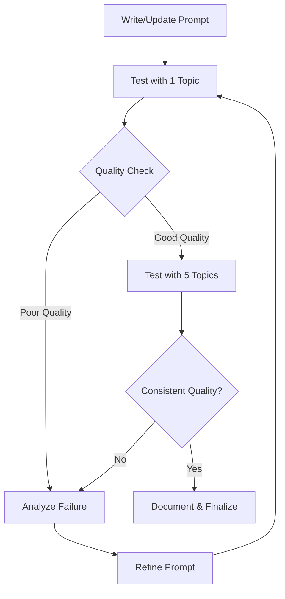

# T0: Prompt Engineering & AI Quality Tuning

## Scope

Update and refine all AI agent prompts in file:docs/prompt-spec.md to ensure high-quality visual explanations that create the "aha moment" for students. This ticket focuses on prompt engineering BEFORE implementing the AI pipeline to establish quality baselines.

**In Scope:**

- Update Librarian Agent prompt (remove "3 topics" constraint, support 1-5+ topics)
- Update Image Steering Agent prompt (enforce "exactly 5 image prompts", emphasize explanatory structure)
- Update AI Director Agent prompt (enforce "≤180 seconds duration", improve narration quality)
- Test prompts with 5-10 diverse STEM topics (Physics, Chemistry, Biology, Math)
- Iterate based on visual quality and pedagogical effectiveness
- Document prompt engineering decisions and rationale
- Establish quality baselines for "aha moment" visuals

**Out of Scope:**

- Backend implementation (separate tickets)
- Frontend implementation (separate tickets)
- Production deployment of prompts

## Acceptance Criteria

**Librarian Agent:**

- [ ] Prompt updated to support variable topic count (1-5+, not fixed at 3)
- [ ] Tested with 3 different content types (Wikipedia, PDF textbook, research paper)
- [ ] Consistently extracts relevant topics with clear descriptions

**Image Steering Agent:**

- [ ] Prompt updated to generate exactly 5 image prompts
- [ ] Emphasis on "explanatory internal structure over icon-like simplicity"
- [ ] Style enforced: "Black-and-white sketchnote with teal/orange accents"
- [ ] Tested with 5 STEM topics, generates pedagogically sound visuals
- [ ] Visual quality: Hand-drawn aesthetic, not photorealistic or cartoon-like

**AI Director Agent:**

- [ ] Prompt updated to enforce "lesson duration ≤180 seconds"
- [ ] Narration style: "Khan Academy friendly, conversational, enthusiastic"
- [ ] Audio-visual sync: Each narration block maps to a checkpoint
- [ ] Tested with 5 STEM topics, generates synchronized scripts
- [ ] Narration explains WHILE drawing (not before/after)

**Quality Testing:**

- [ ] Generate lessons for 5 diverse topics:
  - Physics: Bernoulli's Principle
  - Chemistry: Covalent Bonding
  - Biology: Photosynthesis
  - Math: Pythagorean Theorem
  - Physics: Newton's Second Law
- [ ] Manual review: Do visuals create "aha moments"?
- [ ] Manual review: Is narration synchronized with visual events?
- [ ] Manual review: Is hand-drawn aesthetic maintained?
- [ ] Document quality baselines and iteration notes

**Documentation:**

- [ ] file:docs/prompt-spec.md updated with all changes
- [ ] Add "Prompt Engineering Notes" section documenting decisions
- [ ] Add "Quality Baselines" section with example outputs

## Testing Strategy

**Prompt Iteration Process:**

**Quality Criteria:**

1. **Visual Explanations** (Image Steering):
  - Shows internal structure (not just icons)
  - Pedagogically sound (helps understanding)
  - Hand-drawn aesthetic maintained
  - Teal/orange accents preserved
2. **Narration Quality** (AI Director):
  - Friendly, conversational tone
  - Explains concepts clearly
  - Synchronized with visual events
  - Duration ≤180 seconds
3. **Topic Extraction** (Librarian):
  - Relevant topics identified
  - Clear descriptions
  - Appropriate granularity (not too broad/narrow)

## References

- **Prompts**: file:docs/prompt-spec.md (all agent prompts)
- **Epic Brief**: spec:509268fd-53cc-4271-8fce-6b32f347b891/2989d372-b4c3-4605-a109-950ac7017365 (The "Aha Moment")
- **Tech Plan**: spec:509268fd-53cc-4271-8fce-6b32f347b891/c02c6bb2-6b7c-417a-a9b0-5d34542cd940 (Section 1.2, 3.2)
- **PRD**: file:docs/prd.md (Success Criteria, Visual Quality)

## Dependencies

None (can start immediately)

## Priority

**HIGH** - Affects quality of all AI pipeline tickets (T2-T4)

## Notes

**Why This Matters:**

- Prompt quality directly determines the "aha moment" experience
- Easier to iterate on prompts before implementing backend
- Establishes quality baselines for AI pipeline development
- Reduces rework during implementation

**Recommended Approach:**

1. Start with Image Steering (most critical for visual quality)
2. Then AI Director (narration synchronization)
3. Finally Librarian (simpler, less critical)
4. Test end-to-end with 1-2 topics after all prompts updated

